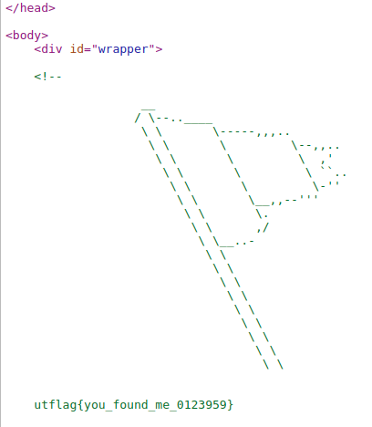

## beginner

### stringy things
Description:
*I know there's a string in this binary somewhere.... Now where did I leave it?*

We get a calc file. lets use the command 'file' to see what it actually is:
```shell
~/Downloads$ file calc
calc: ELF 64-bit LSB shared object, x86-64, version 1 (SYSV), dynamically linked, interpreter /lib64/ld-linux-x86-64.so.2, BuildID[sha1]=8be49a90c694a4f14dd0735d7ad2ffb200753cfb, for GNU/Linux 3.2.0, not stripped
```
So an ELF file is an executable in Linux. It gets generated after it has been through the complile and build process in an SDK (Software Development Kit)

So generallty we can read all files in Linux so lets see what it shows us.
```shell
~/Downloads$ cat calc 
ELF>`@:@8
         @@@@h�����   ���-�=�=X`�-�=�=����DDP�td� � � 44Q�tdR�td�-�=�=/lib64/ld-linux-x86-64.so.2GNU�䚐Ɣ��M�s]z���u<�GNUs !7� � `� � !�=�=�=�?@0@@@��
P��=�������!����=��=��=�� @�
Y��@@ 7"abi-note.c__abi_taginit.ccrtstuff.cderegister_tm_clones__do_global_dtors_auxcompleted.0__do_global_dtors_aux_fini_array_entryframe_dummy__frame_dummy_init_array_entrycalc.c__FRAME_END____init_array_end_DYNAMIC__init_array_start__GNU_EH_FRAME_HDR_GLOBAL_OFFSET_TABLE___libc_csu_fini_ITM_deregisterTMCloneTable_edata__stack_chk_fail@@GLIBC_2.4printf@@GLIBC_2.2.5__libc_start_main@@GLIBC_2.2.5__data_start__gmon_start____dso_handle_IO_stdin_used__libc_csu_init__bss_startmain__isoc99_scanf@@GLIBC_2.7__TMC_END___ITM_registerTMCloneTable__cxa_finalize@@GLIBC_2.2.5.symtab.strtab.shstrtab.interp.note.gnu.build-id.note.ABI-tag.gnu.hash.dynsym.dynstr.gnu.version.gnu.version_r.rela.dyn.rela.plt.init.text.fini.rodata.eh_frame_hdr.eh_frame.init_array.fini_array.dynamic.got.got.plt.data.bss.comment�#��$6�� D�N�o
�  �� � 4�!!������=�-��?��@�0@0@@@�0@0X0`5���   �6S
```
This is only part of the file but it gives us an idea but is not an easy way to read and doesn't really give us any clues. Having read it with cat, we notice that it gives us a mix of human and other character types. 

With the title hinting towards the 'strings' command. Let's give that a go. From the man page:
*_strings_ is mainly useful for determining the contents of non-text files. ... _strings_(1) - Linux man page. Name. strings- print the strings of printable characters in files.*

```shell
~/Downloads$ strings calc
/lib64/ld-linux-x86-64.so.2
__isoc99_scanf
__stack_chk_fail
printf
__cxa_finalize
__libc_start_main
libc.so.6
GLIBC_2.7
GLIBC_2.2.5
GLIBC_2.4
_ITM_deregisterTMCloneTable
__gmon_start__
_ITM_registerTMCloneTable
u3UH
[]A\A]A^A_
Enter an operator (+, -, *,): 
Enter two operands: 
%lf %lf
%.1lf + %.1lf = %.1lf
%.1lf - %.1lf = %.1lf
%.1lf * %.1lf = %.1lf
%.1lf / %.1lf = %.1lf
Error! operator is not correct
```

Now that is easier to read as it is by line. However there are 87 lines to look through and the types of file can contain thousands of lines. What we can use is a command that will help us look for patterns. In this case 'grep'
Again utilising the man page:
*The _grep_ utility shall search the input files, selecting lines matching one or more patterns; the types of patterns are controlled by the options specified.*

OK Can we just 'grep' the file calc? Yes we could and it would give us the same answer. But since we have already used 'strings', lets take that output and put it into 'grep'.

To do this in Linux, we 'pipe' it from one command into another.
*strings | grep* 

One more thing. Now grep is used to find patterns but we need to give it some options. Generally we know the CTF flag stype and in this case it is utflag{} with words between the brackets.

That being the case we can ask 'grep' to search for this pattern and if we generalise the characters  withing it (i.e. search for anything in there) then we should be able to print off the flag.

```shell
~/Downloads$ strings calc | grep -oE utflag{.?*}
utflag{strings_is_op}
```
- -o, --only-matching (show only nonempty parts of lines that match)
- -E, --extended-regexp (PATTERNS are extended regular expressions)

As I mentioned we can do this to the file so the command is still the same, less strings but adding the file name.
```shell
~/Downloads$ grep -oEa utflag{.?*} calc 
utflag{strings_is_op}
```

And finally we can actually use 'cat'. The only difference is that his time, we need to tell 'grep' that we are reading as text.
```shell
~/Downloads$ cat calc | grep -oE utflag{.?*}
Binary file (standard input) matches
```
Here without -a it tells us it finds a match in a binary file.
```
~/Downloads$ cat calc | grep -oEa utflag{.?*}
utflag{strings_is_op}
```
 Adding the additional option of -a now finds the flag.
 - -a, --text (equivalent to --binary-files=text)

### HTML
Description:
*I hid a flag somewhere in the code of the UTCTF website, can you find it?*

We get a link to the website.

https://www.isss.io/utctf/

Lets look at the source code and bang!! We have the flag.



utflag{you_found_me_0123959}

### Magic Bytes
Description:
*My friend sent me this text file and said they put a flag inside. I opened it and it doesn't look like a normal text file to me! Maybe you'll be able to find it.*

We get a .txt file. Again lets check it out with 'file'

```shell
~/Downloads$ file out.txt 
out.txt: PNG image data, 1920 x 1080, 8-bit/color RGBA, non-interlaced
```

OK now we know it is a png file, lets use the default image viewer Eye of Gnome to check out the file

```shell
~/Downloads$ eog out.txt
```


Now we have the flag.
utflag{file_extensions_mean_nothing}

### Run Elf
Description:
*Anyone know how to run an ELF file? I bet you could figure it out.*

We get a run file. Again lets check it out with 'file'
```shell
~/Downloads$ file run
run: ELF 64-bit LSB shared object, x86-64, version 1 (SYSV), dynamically linked, interpreter /lib64/ld-linux-x86-64.so.2, BuildID[sha1]=e29057709baef974009b1e676fd113ed20f1942f, for GNU/Linux 3.2.0, not stripped
```
Lets check to see what the file permissions are with 'ls'
```shell
~/Downloads$ ls -l run
-rw-rw-r-- 1 jim jim 16600 Mar 13 07:56 run
```
OK So we see it is not an executable file.

Lets make it so.
```
~/Downloads$ chmod +x run 
~/Downloads$ ls -l run
-rwxrwxr-x 1 jim jim 16600 Mar 13 07:56 run
```

We can now see the executable bit in place. SO to run the file we do it within the current folder.
```shell
~/Downloads$ ./run
utflag{run_run_binary_9312854}
```
 We now get the flag.
 utflag{run_run_binary_9312854}
 
 ### Cipher Gauntlet
Description:
*Can you make it through all of the encodings and ciphers?*

We get a text file. Again lets check it out with 'cat'
```shell
/Downloads$ cat secret.txt 
01010101 01101000 00101101 01101111 01101000 00101100 00100000 01101100 01101111 01101111 01101011 01110011 00100000 01101100 01101001 01101011 01100101 00100000 01110111 01100101 00100000 01101000 01100001 01110110 01100101 00100000 01100001 01101110 01101111 01110100 01101000 01100101 01110010 00100000 01100010 01101100 01101111 01100011 01101011 00100000 01101111 01100110 00100000 01110100 01100101 01111000 01110100 00101100 00100000 01110111 01101001 01110100 01101000 00100000 01110011 01101111
```

OK there is a lot of what appears to be binary code. With it being a challenge with a lot of codes and ciphers, lets upload the file to GCHQ's CyberChef. This will allow us to add a number of sections to 'bake' a solution.

Right lets try binary first. We get a new selection of text with some instructions.

```
Uh-oh, looks like we have another block of text, with some sort of special encoding. Can you figure out what this encoding is? (hint: if you look carefully, you'll notice that there only characters present are A-Z, a-z, 0-9, and sometimes / and +. See if you can find an encoding that looks like this one.)
TmV3IGNoYWxsZW5nZSEgQ2FuIHlvdSBmaWd1cmUgb3V0IHdoYXQncyBnb2luZyBvbiBoZXJlPyBJdCBsb29rcyBsaWtlIHRoZSBsZXR0ZXJzIGFyZSBzaGlmdGVkIGJ5IHNvbWUgY29uc3RhbnQuIChoaW50OiB5b3UgbWlnaHQgd2FudCB0byBzdGFydCBsb29raW5nIHVwIFJvbWFuIHBlb3BsZSkuCm15eHFia2Rldmtkc3l4YyEgaXllIHJrZm8gcHN4c2Nyb24gZHJvIGxvcXN4eG9iIG1iaXpkeXFia3pyaSBtcmt2dm94cW8uIHJvYm8gc2MgayBwdmtxIHB5YiBrdnYgaXllYiBya2JuIG9wcHliZGM6IGVkcHZrcXt4eWdfaXllYm9fenZraXN4cV9nc2RyX21iaXpkeX0uIGl5ZSBnc3Z2IHBzeG4gZHJrZCBrIHZ5ZCB5cCBtYml6ZHlxYmt6cmkgc2MgbGVzdm5zeHEgeXBwIGRyc2MgY3liZCB5cCBsa2NzbSB1eHlndm9ucW8sIGt4biBzZCBib2t2dmkgc2MgeHlkIGN5IGxrbiBrcGRvYiBrdnYuIHJ5em8gaXllIG94dHlpb24gZHJvIG1ya3Z2b3hxbyE=
```

The spacer at the end of the code indicates that it might be Base64.  Lets try that in Cyberchef.
```
New challenge! Can you figure out what's going on here? It looks like the letters are shifted by some constant. (hint: you might want to start looking up Roman people).
myxqbkdevkdsyxc! iye rkfo psxscron dro loqsxxob mbizdyqbkzri mrkvvoxqo. robo sc k pvkq pyb kvv iyeb rkbn oppybdc: edpvkq{xyg_iyebo_zvkisxq_gsdr_mbizdy}. iye gsvv psxn drkd k vyd yp mbizdyqbkzri sc lesvnsxq ypp drsc cybd yp lkcsm uxygvonqo, kxn sd bokvvi sc xyd cy lkn kpdob kvv. ryzo iye oxtyion dro mrkvvoxqo!
```

The hint here relates to Romans. They used to use a Caesar Cipher which is a rotating cipher. In CyberChef they call this ROT13. Lets try that.
```
zlkdoxqrixqflkp! vlr exsb cfkfpeba qeb ybdfkkbo zovmqldoxmev zexiibkdb. ebob fp x cixd clo xii vlro exoa bccloqp: rqcixd{klt_vlrob_mixvfkd_tfqe_zovmql}. vlr tfii cfka qexq x ilq lc zovmqldoxmev fp yrfiafkd lcc qefp ploq lc yxpfz hkltibadb, xka fq obxiiv fp klq pl yxa xcqbo xii. elmb vlr bkglvba qeb zexiibkdb!
```
So even though it is ROT13, we still can't read the file. However the hint says it is shifted, so we have an option to change this. Click on the updown arrows to shift by one each time and watch the code change. When youhit shift 16, we have the final flag.
```
congratulations! you have finished the beginner cryptography challenge. here is a flag for all your hard efforts: utflag{now_youre_playing_with_crypto}. you will find that a lot of cryptography is building off this sort of basic knowledge, and it really is not so bad after all. hope you enjoyed the challenge!
```
 The flag
 utflag{now_youre_playing_with_crypto}
 
 ### Sizzling Bacon
Description:
*My buddy Francis is _really_ into Bacon. He loves it so much that he gave me this encoded bacon-themed flag (he said he was inspired by the sound of sizzling bacon).*

We get a text string. 

*sSsSSsSSssSSsSsSsSssSSSSSSSssS{SSSsSsSSSsSsSSSsSSsSSssssssSSSSSSSsSSSSSSSSsSSsssSSssSsSSSsSSsSSSSssssSSsssSSsSSsSSSs}*

Bacon is highlighted a number of times. If we do a search for bacon and cipher, we find that it does exist.

From wikipedia:
*Bacon's cipher or the Baconian cipher is a method of steganographic message encoding devised by Francis Bacon in 1605. A message is concealed in the presentation of text, rather than its content.*

We can use CyberChef again. Simply  search for Bacon and it brings up the Bacon Cipher Decode Operation. Play about with the options:
- Alphabet (Complete)
- Translation (Case)

And we get the flag:
UTFLAGCRISPYBACONCIPHER
Amend it with braces and #boom, the next flag.

 UTFLAG{CRISPYBACONCIPHER}
