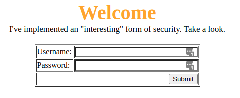
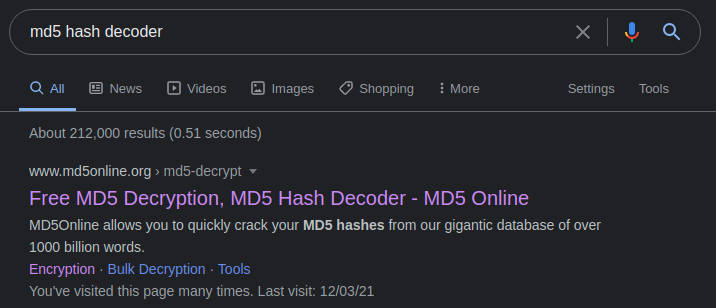
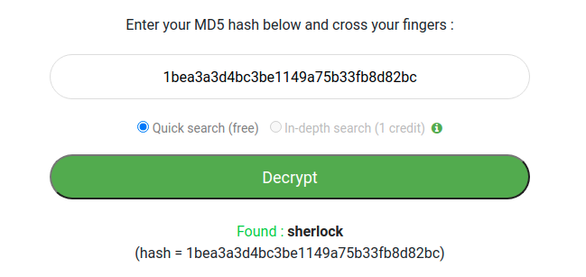
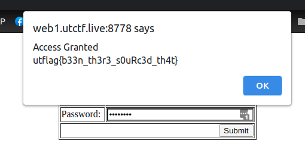

## web

### Source it!
Description:
*Can you see how this page handles authentication?*

http://web1.utctf.live:8778/

When we look at the front page we have a login portal. As it says in the title, lets check out the source.


OK, the source gives us some code. It looks like we need to put in the password that equates to a hash. Luckily it also tells us the user should be 'admin'.

```html
<script src\="[assets/js/main.js](http://web1.utctf.live:8778/assets/js/main.js)"></script>

<script>
function checkPassword(form) {
password1 = form.password1.value;
name = form.name.value;
var username = "admin";
var hash = "1bea3a3d4bc3be1149a75b33fb8d82bc";
var hashedPasswd = CryptoJS.MD5(password1);
if (password1 == '')
alert ("Please enter Password");
else if (username != name) {
alert ("\\nYou lack access privlages...")
return false;
```

As well as telling us the hash, it also suggests that it is a variant of MD5. Let's look at some online hash cracking sites.



Lets use the first one and check our hash.



Now we have our username and password, lets type it in and see what we get.



Flag
utctf{b33n_th3r3_s0uRc3d_th4t}
