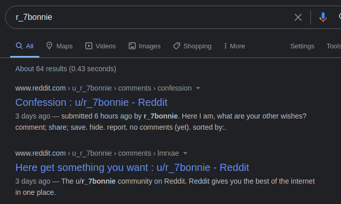
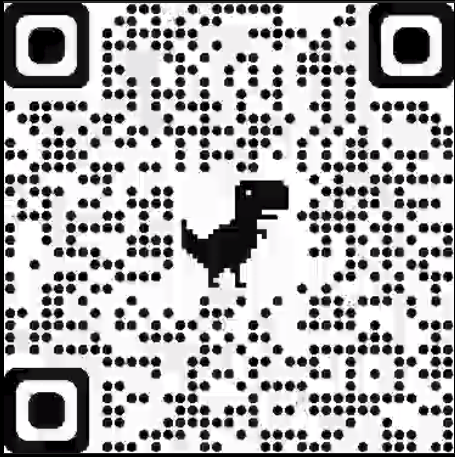

## OSINT/The Reporter
This weekend I took part in darkCON CTF. We came 273rd out of 663 teams (we only answered one main question, the follow up and the Sanity check!!)

This was the challenge description:

*Miss Lola beck has something on her social media account. You are Agent P. find the secret.
Hint : username l.beck*

For any OSINT challenges you can use a number of tools including Sherlock, but as I was running out of time, I just used:

https://whatsmyname.app/

Adding her username of l.beck, we were given a number of options.


As it was already mentioned that it was a social media site, I then checked about.me


Found her. She seems to have left some details on the page that might be useful.
```
725f37626f6e6e6965
```

This looks like a hex, so I already had [Cyberchef](https://gchq.github.io/CyberChef/#recipe=From_Hex('Auto')&input=NzI1ZjM3NjI2ZjZlNmU2OTY1) open so I baked it with "from hex"


So with my "r_7bonnie" I did a Google search and found a possible reddit account.



When I investigated further, it had an mp4 file, that repeated itself. It appears to be an image of Lola and a QR code merged together.


I downloaded and played the image pausing it on the QR code, created a screenshot and looked to manipulate it in either GIMP or INKSCAPE.



On the off chance that the zbarimg would actually read it, I gave it a go.

```shell
$ zbarimg qrcode_darkCon.png 
QR-Code:darkCON{os1nst_1s_nic3}
scanned 1 barcode symbols from 1 images in 0.02 seconds
```
Bonus - This gave me the flag:

darkCON{os1nst_1s_nic3}
