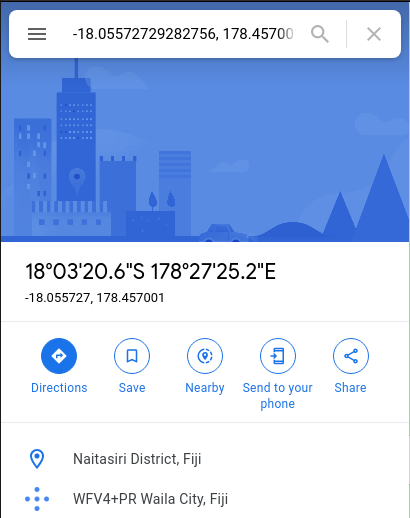
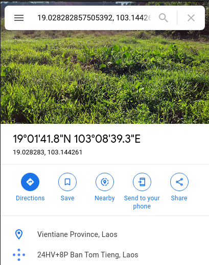

#### The Conspiracy

Category: Cryptography
Description:

>There was once a sailor who travelled to many countries. He was a quirky old man. He said many many things, and most of what he said never made sense to anyone. He considered himself ahead of his time, and said that the people of his time were unworthy of his wisdom. Soon he was lost to the ages, but his diary wasn't. Are you worthy of decoding his wisdom?
---
We get to download a file: diary.txt

When we open it, we see:

```text
ZHNjeygtMTguMDU1NzI3MjkyODI3NTYsIDE3OC40NTcwMDE0MzEzMTY3NCksKDE5LjAyODI4Mjg1NzUwNTM5MiwgMTAzLjE0NDI2MDcxMjA3MTA3KSwoNDIuNTM2NzA1OTkxMjY2MTQ2LCAxLjQ5MzAzNDQ2MTIyNzY5MzMpLCgzOC41ODkzNjk3MjE3MzU0LCA2OC44MTYzMjUyMzA1ODk2NyksXywoNTAuODUxNTE4OTQ4MjA2Nzk1LCA0LjM2MDE4MDg1MzU4MTk4NiksKDcuNjcxODYzNTM4NDUzMzg2LCAzNi44MzcyNjA5NTY5ODk1MiksXywoMzguNjE5NTA2NzQwNTg3MDM1LCAzNC44NTUxMjY0MjcxMTAwNCksKDQ3LjQyODA2MTU3MTIzNTQ1LCAxOC45OTg0MjExMDE5MDM2MDIpLCgzMC4xOTM4NzE1ODM1MzkyMSwgMzEuMTI0OTY2MTE2MTI1NzMpLF8sKC0wLjIzMTc3NTU5NDI2MTExNTU4LCAtNzguNTAzMzk2MzA4Mzk0OSksKC0xMi44NTQ0NjkzNjczMzQ1NSwgMTMyLjc5MjYyNDMzODgzMjk4KSwoNDQuNDI0MjMxMjUyNTc3NDM1LCAyNC4zNTAyNDExNjYyNzkyMjYpLCgyNC44MTk1NjQ3NDEzOTIzLCAxMjAuOTcyMzY3NTQwMDUwNTgpLCgxOC41ODQ0NTY5NzQ0MDM0ODcsIC03Mi4zMTgxMjE4OTYxNDc3Mil9
```

If we paste it into GCHQs CyberChef input field, we get what appears to be the flag format with dsc{} with co-ordinates in the centre, each one surrounded by normal brackets.

```
dsc{(-18.05572729282756, 178.45700143131674),(19.028282857505392, 103.14426071207107),(42.536705991266146, 1.4930344612276933),(38.5893697217354, 68.81632523058967),_,(50.851518948206795, 4.360180853581986),(7.671863538453386, 36.83726095698952),_,(38.619506740587035, 34.85512642711004),(47.42806157123545, 18.998421101903602),(30.19387158353921, 31.12496611612573),_,(-0.23177559426111558, -78.5033963083949),(-12.85446936733455, 132.79262433883298),(44.424231252577435, 24.350241166279226),(24.8195647413923, 120.97236754005058),(18.584456974403487, -72.31812189614772)}
```

The description highlighted that he travelled to many countries, so rather than plot them on a graph, I entered the first one into Google Maps. We get:



So if we are talking about countries, Fiji, maybe? Lets try another.



Next one was Laos. So it could spell something "FL" so I continued this for the rest of the co-ordinates and came up with the following countries.

- Fiji
- Laos
- Andorra
- Tajikistan
- _
- Belgium
- Ethiopia
- _
- Turkey
- Hungary
- Egypt
- _
- Ecuador
- Australia
- Romania
- Taiwan
- Haiti

This gave us - FLAT_BE_THE_EARTH

Flag:
dsc{flat_be_the_earth}
