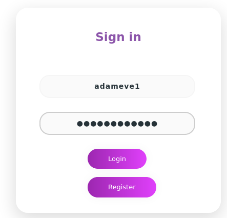
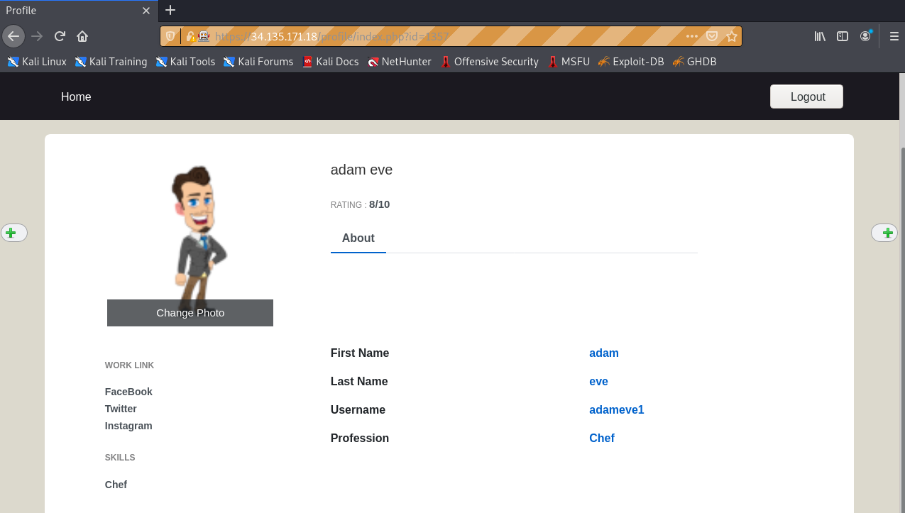
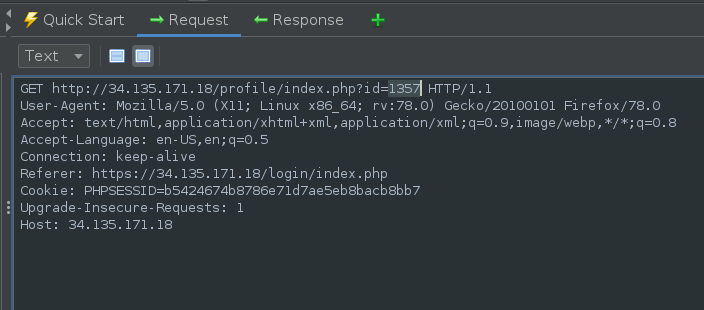
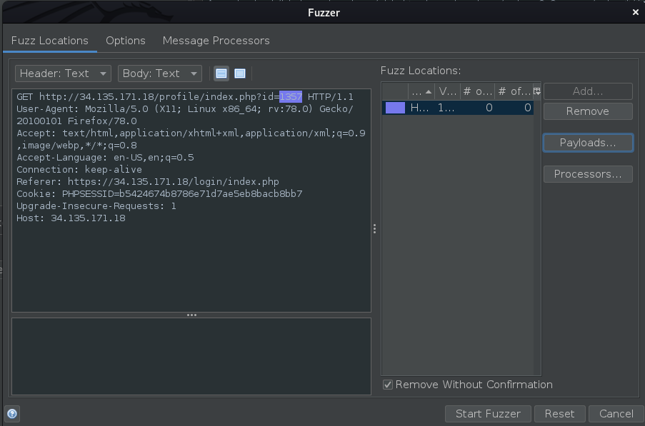
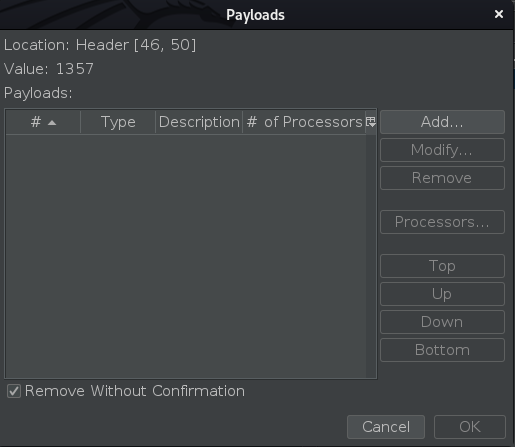
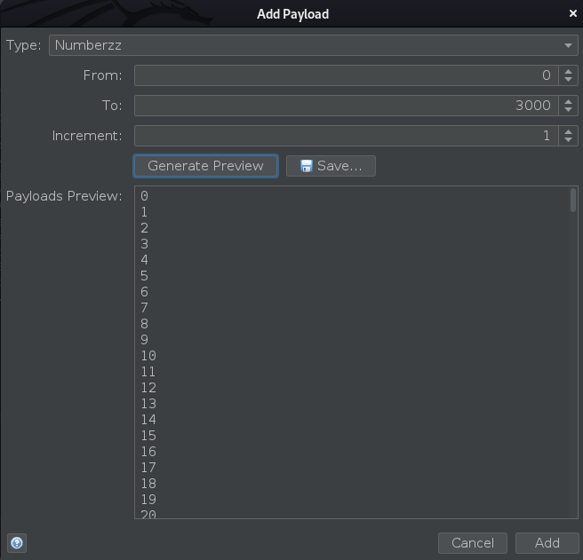
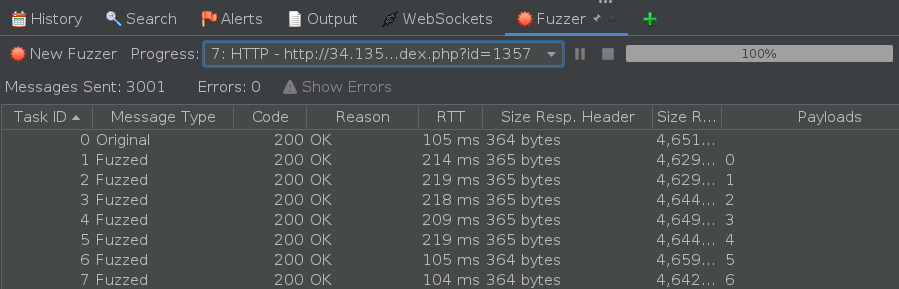
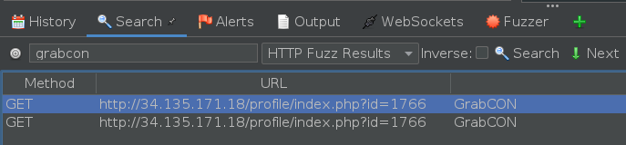
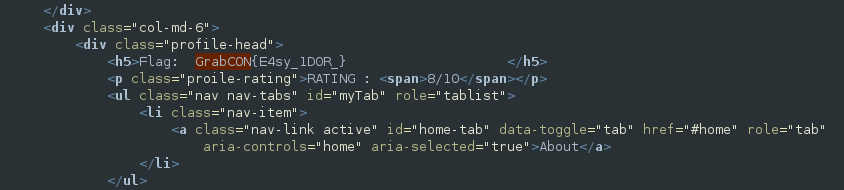

## Web - Door Lock

Description:

The door is open to all! See who is behind the admin door??

http://34.135.171.18/

Author: **r3curs1v3_pr0xy**

Following the same format as the previous web challenge, we are back in our food based website.


Here us the Login page within the menu.


This time we need to register and then sign in.



This time we get access to our profile.



If you look closely, as I was using the build in browser within ZAP, you can see that I have a Profile ID of 1357.

I initially checked the profiles of users 0 and 1 to see if I could access the admin, to no avail. I did try some additional ids but did not want to brute force as I thought it was not allowed.

Once the challenge was finished I set up a ZAP fuzzer for 3000 ids.



Opened fuzzer



Opened payloads



Generated payload



Then started fuzzer. Once it was completed, I was able to see the complete list. You could then filter by size response body and see the difference.



However as we were expecting a flag, I did a search using the HTTP Fuzz Results for the flag prefix. 



This came up with two finds both in the id=1766.

```html
GET http://34.135.171.18/profile/index.php?id=1766 HTTP/1.1
User-Agent: Mozilla/5.0 (X11; Linux x86_64; rv:78.0) Gecko/20100101 Firefox/78.0
Accept: text/html,application/xhtml+xml,application/xml;q=0.9,image/webp,*/*;q=0.8
Accept-Language: en-US,en;q=0.5
Connection: keep-alive
Referer: https://34.135.171.18/login/index.php
Cookie: PHPSESSID=b5424674b8786e71d7ae5eb8bacb8bb7
Upgrade-Insecure-Requests: 1
Host: 34.135.171.18
```

Then looking at the response, the words and flag were highlighted in red.



Flag:
#####  GrabCON{E4sy_1D0R_}   
