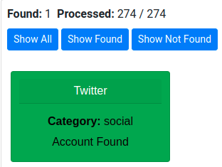
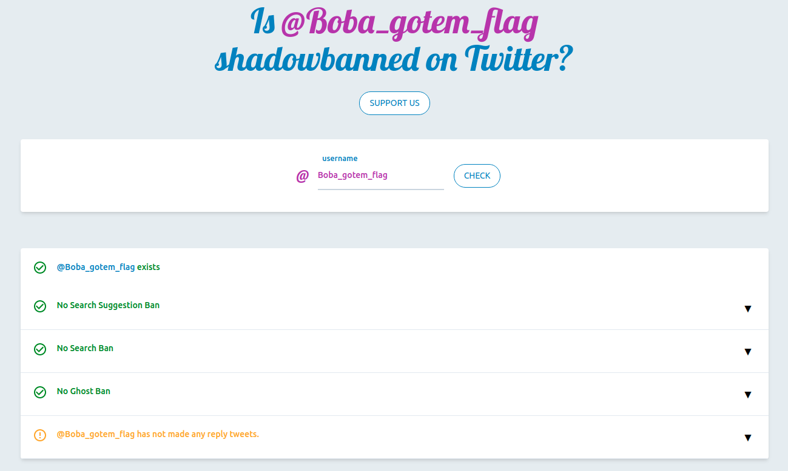
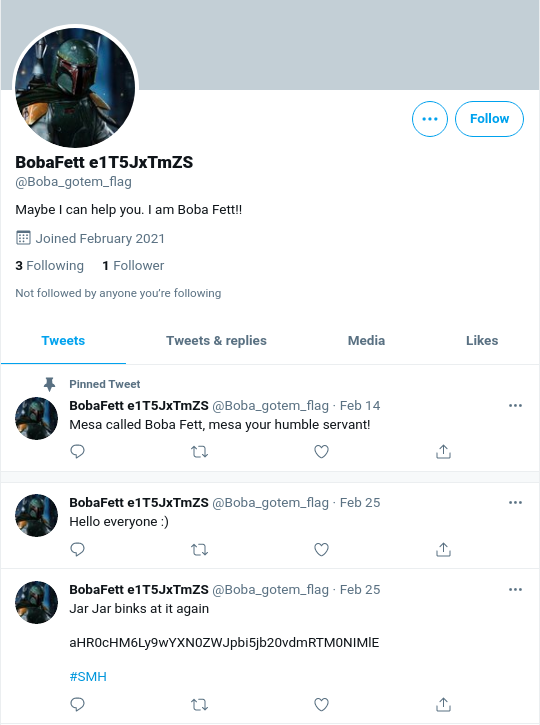
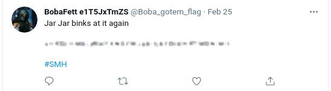
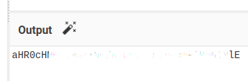
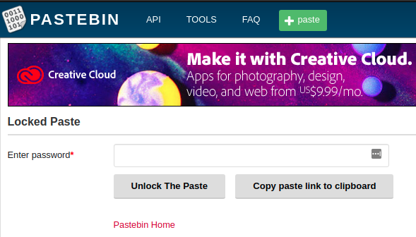
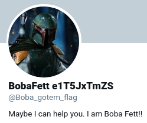
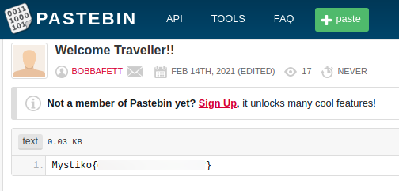

## challenge - An Easy OSINT
This weekend I took part in mystikoCTF

This was the challenge description:

*_All I can give you is a hint, nothing more  
Boba_gotem_flag is my name, now go explore  
Follow the blue bird, for it is where I reside.  
If lost! Follow the hint, as it will be your guide.*

For any OSINT challenges you can use a number of tools including Sherlock, but as I was running out of time, I just used:

https://whatsmyname.app/

This found only one account, in the social media section. 

However the categoy link shows you a shadowban.eu domain. What is that?

*What Is Shadowbanning?
Shadowbanning is when your posts or activity don’t show up on a site, but you haven’t received an official ban or notification.
It’s a way to let spammers continue to spam without anyone else in the community (or outside of it) seeing what they do.
That way, other social media users don’t suffer from spam because they can’t see it. The spammer won’t immediately start to look for ways to get around the ban, because they don’t even realize they’ve been banned.*

Interesting - I checked the shadowban site for Boba and it confirmed the account existed

Now lets check out the social media account.

So what do we see. It looks as if there is some encrpted text on the last post.

Using our favourite GCHQ tool, Cyberchef, we paste it in. If we are not sure what operation we need to search for we can do one of two things. Use the Magic operation that will automatically run through a number of scenarios and give you a selection of possible answers or if you see the magic wand and hover the mouse over it, you will see that base64 will provide a valid answer. Click on the wand and we see the next part of the puzzle. 

It provides us with a pastebin link.

What is pastebin?
*Pastebin is a website that allows users to share plain text through public posts called “pastes.” The site currently has 17 million unique monthly users. Why is it so popular, and where did it come from?
There are many similar web applications, known as “paste sites,” that have developed since the original Pastebin was launched in 2002. The need for Pastebin rose out of user activity on the Internet Relay Chat (IRC). IRC is an instant messaging application launched in 1988. It’s designed for a large user base to communicate in real-time, and is popular for sharing plain text, including blocks of source code.*

However we see it needs a password. All we know is that we have a twitter feed. Lets have another look.

His name does look strange. What about the e1T5JxTmZS at the end of his name.

This works and we gain access to the pastebin and the flag:

Mystiko{?????????????} 

PS. Not the real flag, you'll have to follow the instructions for that. #boom #insertsmileyhere 
