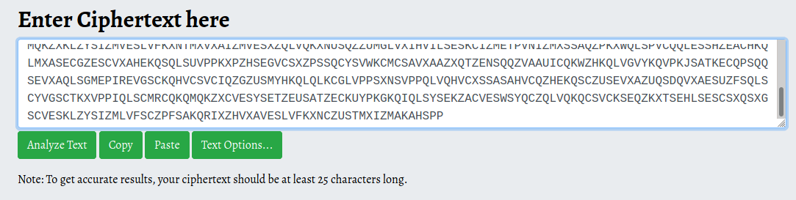
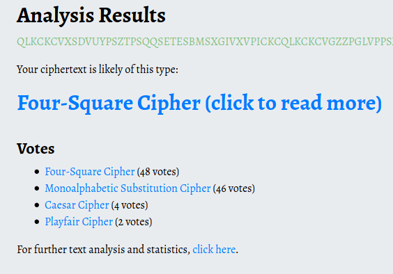
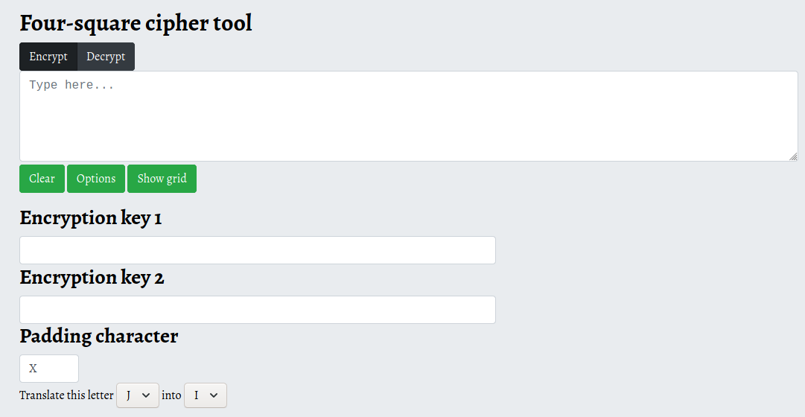
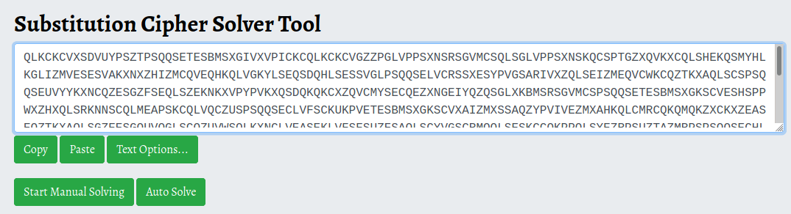
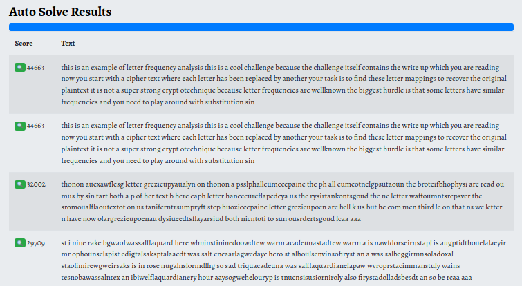
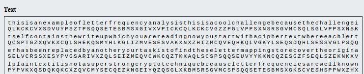

## challenge - Ciphertext

This was the challenge description:

*"QLKCKCVXSDVUYPSZTPSQQSETESBMSXGIVXVPICKCQLKCKCVGZZPGLVPPSXNSRSGVMCSQLSGLVPPSXNSKQCSPTGZXQVKXCQLSHEKQSMYHLKGLIZMVESESVAKXNXZHIZMCQVEQHKQLVGKYLSEQSDQHLSESSVGLPSQQSELVCRSSXESYPVGSARIVXZQLSEIZMEQVCWKCQZTKXAQLSCSPS........"*

I have only shown part of the description because it appears to be the actual challenge.

With such a large amount of code types out there, it's always good to use tools to try and help you pin point the areas you need to focus on. Today I will be using:

https://www.boxentriq.com/code-breaking

I often use the Cipher Identifier to give me that direction.

So we now have somewhere to look. If we check the Four Square Cipher, we find that:

*"The four-square-cipher was invented by the French amateur cryptographer Félix Delastelle. It is a digraph cipher, where each pair of letters in the ciphertext depends on a pair of letters in the plaintext. It uses four 5x5 squares to translate each digraph."*

However, when we look at the method it requires some other information that we don't appear to have.

So what next? Looking at the votes, 48 for the Four Square Method and 46 for the Monoalphabetic Substitution Cipher - let's try that.

*"The monoalphabetic substitution cipher is one of the most popular ciphers among puzzle makers. Each letter is substituted by another letter in the alphabet. If it contains word boundaries (spaces and punctuation), it is called an Aristocrat. The more difficult variant, without word boundaries, is called a Patristocrat"*

Let's paste our text and look at Auto Solve.

This gives us a number of choices each with a score. We can see that the first one looks like a winner. 

Expand the selection and read what the author has written, following his instructions and the flag is yours.

