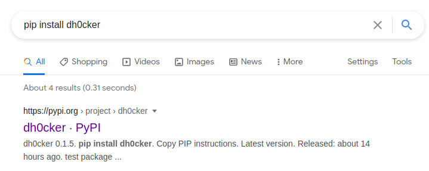

## challenge - Container

This was the challenge description:

*Our company has been hacked. We have fired the sysadmin, in case he was trying to sabotage us. Reviewing his bash_history file we found this:*

*pip install dh0cker*

Not much to go by initially, but we can see that it is using "pip" which is a python packet manager. If that is the case we should be able to check out the library online.

More details for "pip"
https://realpython.com/what-is-pip/

So a Google Search is in order.

No more hints. The description helps you here, so use your time to get familiar with the pypi.org project website format and get that flag!
