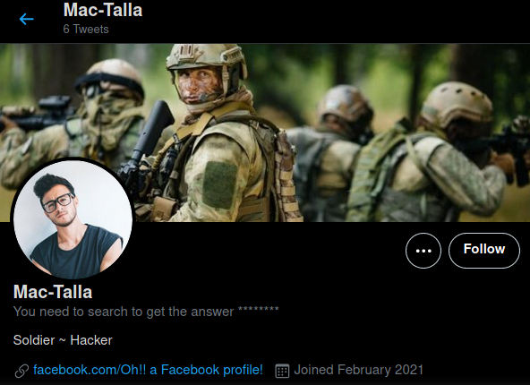

## challenge - Find the right media !

This was the challenge description:

*"We lost a soldier and need you to find him again, his name is Mac-Talla. Can you help us ?"*

The hints are:

*Did you checked a bird perhaps?*

*A social media platform can help you, it has a bird as logo.*

So another possible username. The hints more than likely indicate Twitter. Let's check with a Twitter search to see what we find.

This highlights two areas to look at.

- the image confirms the challenge description
- the next social media site to investigate.

Now that we have found a search vector (what a great word!!), I'm going to leave you here. 

You've got this one. You are soooooo close, now go get that flag soldier!!!!
