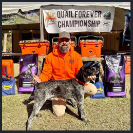
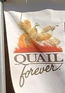
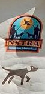
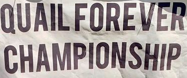
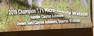

## challenge - Good Dog

This was the challenge description:

*What city was this photo taken?*

OK, we have a photo. What do we know about it?

This is a difficult challenge to give hints (without giving the game away) but I will try.

OSINT (IMHO) is about observation and creating links that are both obvious and effective. You also need a good dose of common sense to help reduce the data you review.

Four areas to focus on from the image:

The first three images allow you to target the groups and location with the fourth image narrowing down the timeline.

Some excellent resources are:

- Google Images (reverse image search)
- Yandex Images (reverse image search)
- Social Media (Facebook)

Enjoy and get that flag!!
