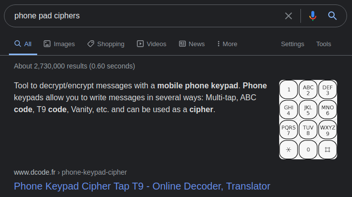
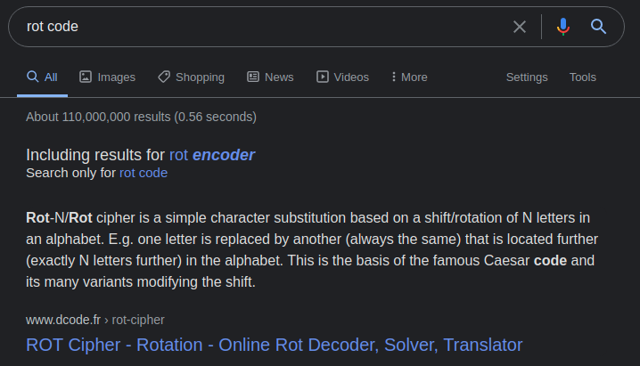
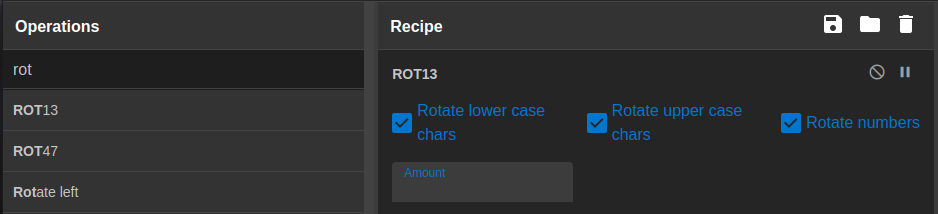
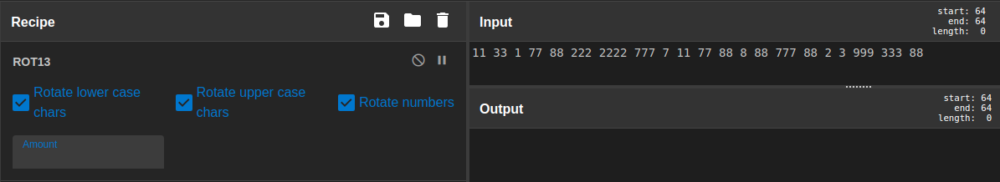

## challenge - Look Beyond What You See

This was the challenge description:

*My friend PAT Sent me this number multiple times via text on my phone. But TOR sent me the same text 5 times before him. I am confused, help me figure out what it says.*

```
11 33 1 77 88 222 2222 777 7 11 77 88 8 88 777 88 2 3 999 333 88
```
So what can we deduce from the code. There are single numbers and numbers that repeat themselves.

These numbers may be used to type SMS on the older mobile phones. Let's do some Google searching for phone pad ciphers.



It reveals that it could be a number of types:

- Code T9 (SMS)
- Multi-TAP Telephone Code (SMS)

OK Let's look back at the description. Two items stand out from the text and both are completed with capital letters.

- PAT (from what we now know that could be the reverse of TAP)
- TOR (again following the same pattern, it could be ROT reversed.)

If that is the case, we could look to ROT the code, but how many times and what does it mean?

Lets search for ROT Cipher in our friend Google.



This link is to decode.fr a great website that you should keep an eye on for your decrypting challenges, but for this challenge, lets use GCHQ's CyberChef.



First, we use the search facilty to get the ROT cipher. Looks like it has 13, which as we know is a rotation of 13 letters. 

Copy our numbers across and ensure that we have the right ROT number. Now what ROT value should we use? Lets check out the description again.



What now?

With the ROTated numbers, lets go to the Multi-TAP decoder we found online at decode.fr and see what happens.

#boom Code is ours!!
#everyoneisawinner
