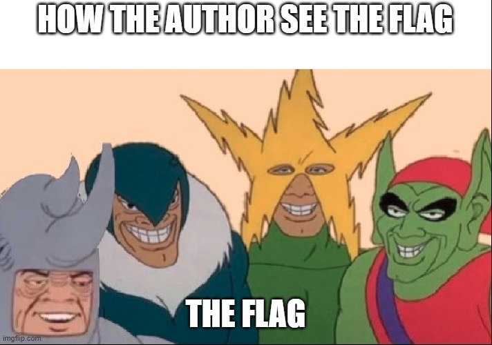

## challenge - Me and the Boys

This was the challenge description:

*Spider man is hunting down the bad boys and looks like they are hiding some where 🕵️*



We were given a image file bad_boys.jpg. I ran through everything that I would normally do for these types of pictures. The list is almost endless.

- file
- strings
- hexedit
- steghide
- binwalk
- foremost
- stegosuite
- stegoveritas

I even spent hours looking at the image, where I had completed (what appeared to be) a similar task, where the image size was hidden and I would have to increase the size of the width and height in hexedit (other tools are available.)

After some time I asked for some assitance which was provided in the form of advice. This advice was ......(not telling you!!) but what it did, was to remind myself of the basics. "Do something, record it, check it again"

Now in this case, lets start with the top of my list. 
### file
Simple description of the file, so I know I am dealing with the right tools. 
```shell
~/Downloads$ file bad_boys.jpg 
bad_boys.jpg: JPEG image data, JFIF standard 1.01, aspect ratio, density 1x1, segment length 16, progressive, precision 8, 711x499, components 3
```
So we know it is a jpeg. Whats next? Lets follow the list:

### strings
So from the linux.die.net man page:
For each _file_ given, GNU **strings** prints the printable character sequences that are at least 4 characters long (or the number given with the options below) and are followed by an unprintable character. By default, it only prints the strings from the initialized and loaded sections of object files; for other types of files, it prints the strings from the whole file.

So let's run the command:
```
:~/Downloads$ strings bad_boys.jpg
JFIF
l]7K
nW!H7v
QVmet
%YoT6
nTwY
...
...
5\b!yt`I
PVk/
k8*&
^k19
	x3+
T eW9*************************ZXI=
8bWL
54g;
36i@
Fal[
pT=M/9
3n%n#S
q-\T,
DD>QE9`
 Dxbji4qoM2a
:~/Downloads$ 
```
There are 895 lines produced as part of the strings command. However now that I take the time to look at it. I find something that is familiar. I recognise the style of code with the '=' at the end. This is a filler for Base64. 
From wikipedia:
*Base64 is a group of binary-to-text encoding schemes that represent binary data (more specifically, a sequence of 8-bit bytes) in an ASCII string format by translating the data into a radix-64 representation.*

So lets stick with the command line and see if we can decode it. Base64 decoder is built in to the command line on Linux and if you follow the man or help features you will find the arguement required. How do we get the text to the actual command. Well in Linux we can pipe one command to another. Do some research on that. What does 'echo' do and what happens when I pass it to another command. How many times can you do this?

```shell
~/Downloads$ echo 'eW**oops_whatis_missing**ZXI=' | base64
*answer_will_appear_here*
```

So what is next. It appears that it is only part of the answer. This is where deliberate and steady investigation pays off. Lets continue to work our way up the strings file.

```
	:C%
$M9sC
|&iOK
d%Bv
.Z)R96
	5f {This_looks interesting, your's will look different} 65
,IO4C
```

A few screens higher and we see another set of characters. This time in what appears to be a hexidecimal form. What is this 'hex' form. Remember wikipedia is our friend:

*hexadecimal (also base 16 or hex) numeral system is a positional numeral system that represents numbers using a radix (base) of 16. Unlike the common way of representing numbers using 10 symbols, hexadecimal uses 16 distinct symbols, most often the symbols "0"–"9" to represent values 0 to 9, and "A"–"F" (or alternatively "a"–"f") to represent values 10 to 15.*

Again, lets use the command line. I have already mentioned 'hexedit' but this time we will use 'xxd' a similar tool to convert this hex to something that is readable.

Again, as per our previous command line work, if we check the man or help features of 'xxd' you will find out how to change it to readable text.
```shell
~/Downloads$ echo '5f ** ** ** ** ** ** ** ** 72 65' | xxd 
_again*the*answer*appears*here_
```
Now I thought I had both parts of the flag but each time I entered it, it failed. 

So what now. So far I have a quote that actually soundsand looks familiar. A quick search brings me to a Superman poster (no more hints!!)

Right. What now? I add the additional words to the first two parts and complete the phrase #boom I have the flag and the points!!

But what about the challenge? It must be in the strings. I did some further research and yes, I found the final piece of the puzzle. 

This time I copied the whole of the string output, put it into GCHQ CyberChef and ran it through some of the popular operations. It came up with a Caesar style cipher not far from the other two.

Great Challenge, even if I was lucky with the final part! 


