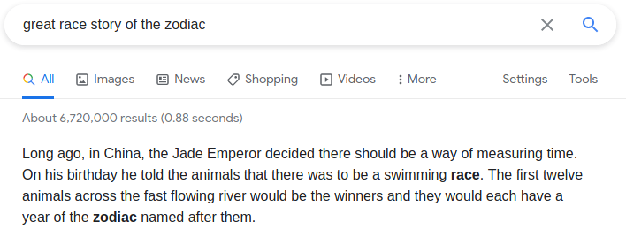
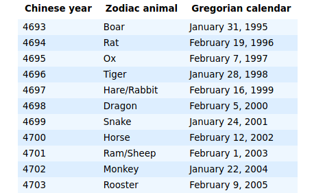

## challenge - One time pad

This was the challenge description:

*what year is it according to the Great Race Story of the Zodiac.*

OK, so we can look at searching Google for some details on the Great Race Story of the Zodiac. 

So we see the Chinese Zodiac matches years against animals. Further investigation highlights that the Chinese can also measure years differently.

However reading the question it can either be a year or an animal.

Two possible options - Lets see how lucky you are :)

Flag:
Mystiko{???????}
