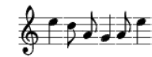

## challenge - Rythm, Soul, A Cappella

This was the challenge description:

*"Music can help you to get the flag"*

We get two files:
- flag.7z (zipped file that requires a password to extract)
- Note_from_musician.txt

The note from the musician contains two items of text.

```
key: MIICdwIBADANBgkqhkiG9w0BAQEFAASCAmEwggJdAgEAAoGBALuea9FcqCCbPBF+PRdronBk0X5aW1tim974aASApzAQ4ITTGMUs//dblcbFDMcPV2NRLZdTgxMhmz2LUDMmtOfYVwLHJna3sfAKL5zZ2LF3iT+WA2BdeUDFKTjqww/+zJjOlTLuuk4NiYwZu255Z0kKgedHJoX3/Vz6rb4/z5JtAgMBAAECgYB2bk0OzldOpc7oF/DGTOov2mQnRzAt4nQT7mfyl6dxfuXK0lnrdTlqUgScgRxMt1FpXv/RayTtOaR91+fbMg60yOddfzyFbXTVW2gLdjS+l/NXoW0+icnOSrigSBuwUHY45f/8+9W+yVxw1NMRtKRcaUyO+4z2YOekb54jF+mQnQJBAPG0qhWcHuboN+FOo0afoxajaqm5fAg4nRU9sCov7YndFcEGcBn91mXbAcvd0w4jiS0UX4PoYXPxKtiR1cWJmssCQQDGtua1jN0cFzWTGmVnL7HUXSyGU4iLCcyLb1Skmq59I0lT9iwcscIJX6ba28DosWqknsr8CEMpH8kcjf1Rt8inAkEAl7Z+y/Gis+0upg1mDv5EsAEDAmWapM5kSuDdop1SzCYpcW9JDgd2e5hsGDq0Lzu+7rzK91D1WoEWE7n2JHeq4QJBAJbVqpXQUN3LuDzq4mHK0D8UYoGr0o9HZt3IKgWv7BbMvBJhX+Z//3tCAdNKz0lRslM2vXlFhEUo/W0RUmG/ES0CQC+UJPvdQQHkFHrBA03dpfQ4synMbK6P2WlLEKuBfgMxj0BscPkIXKzm1UWO7/a4TPwOjhWptVP2mQFdYpVm+MU=
```

```
Msg: ViFQW7gwx5J9T4l1NxfxQnu4opCxii9LKuY33cuHjHUrWlxFANVc9eejoUA+tHiHpHEAzzdOHPvp7HwDl49wShO9FVad5P8vRsJth8GhQ/8VsQ0/xNdzZsQCROYrOGsNWX/zkYehKH/5Wx9YRUb/j4k1ZWqIgPFCaI5UjxG7ndE=
```

Assuming that the title can help us guess what type of challenge this is - capitals RSA, we can do a quick search on RSA keys.

*RSA key is a private key based on RSA algorithm. Private Key is used for authentication and a symmetric key exchange during establishment of an SSL/TLS session. It is a part of the public key infrastructure that is generally used in case of SSL certificates.*

So lets assume that we have a private key and a message to be decoded. A search in Google *identify public or private  rsa key online* came up with a few suggestions. The one I went with:

https://www.devglan.com/online-tools/rsa-encryption-decryption 

is a simple web based affair, where you enter your public/private key and encrypted message, which then extracts the data.

Now we have a code for the 7z file.

```shell
7z e  flag.7z                                                                                7 ⨯

7-Zip [64] 16.02 : Copyright (c) 1999-2016 Igor Pavlov : 2016-05-21
p7zip Version 16.02 (locale=en_GB.UTF-8,Utf16=on,HugeFiles=on,64 bits,1 CPU AMD Ryzen 5 3500U with Radeon Vega Mobile Gfx   (810F81),ASM,AES-NI)

Scanning the drive for archives:
1 file, 13914 bytes (14 KiB)

Extracting archive: flag.7z
--
Path = flag.7z
Type = 7z
Physical Size = 13914
Headers Size = 154
Method = LZMA2:24k 7zAES
Solid = -
Blocks = 1
    
Enter password (will not be echoed):
Everything is Ok

Size:       19329
Compressed: 13914
```

This finally extracts a flag.docx file. When we look at it, it provides us with a line of text:
*Music is the only thing I have ever known that does not have any rules at all*
and an image of some musical notes.



Needless to say this is only a portion of the image. Now all you need to do is look for a way to decode it!

Remember the online sites.

Now we have the sheet music decoded, it still looks to be encrypted.

Maybe some research into the quote in the .docx file? All I'll say is that the band Josh is in may mean that the cipher is really old!!

#boom The flag is yours!!
