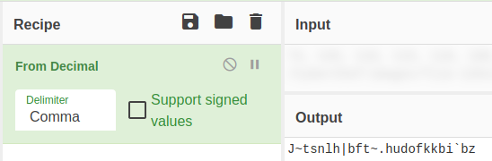

## challenge - Simple XOR

This was the challenge description:

*"A simple XOR challenge"*

We are given a text file with the following data:
```
74, 126, 116, 115, 110, 108, 104, 124, 98, 102, 116, 126, 127, 104, 117, 100, 111, 102, 107, 107, 98, 105, 96, 98, 122
```

Initially my first thoughts say it looks like a decimal code.

So lets try and decode this. Again, the classic GCHQ's CyberChef is a good starting point.

Let's load up the data as a file to CyberChef or just paste in the contents. As we have already decided why type of operation we will require - decimal, we will now search for the "From Decimal"



Once we have dragged that across, we can see that an output is provided. By doing this and gettingthe same answer as me, you have shown you can use the GCHQ tool.

That being the case.........

This is where we part ways my young Padawan. I have provided the tool to complete this challenge and some instruction.

My hint now is "Remember the description" (a simple XOR challenge). Use what you have seen so far with the tool and you will get the flag. Finally it's called CyberChef for a reason - use multiple components and bake the solution!

Remember:
- “Once you start down the dark path, forever will it dominate your destiny. Consume you, it will.” – Yoda
- “Always pass on what you have learned.” — Yoda
- “Patience you must have my young Padawan.” — Yoda
