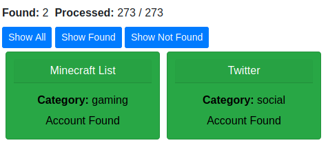
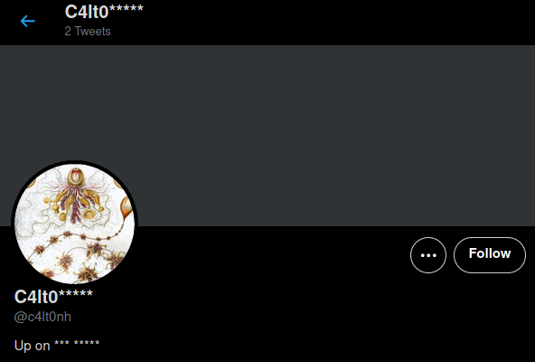

## challenge - Up on the hill

This was the challenge description:

*"We have to find a monument at C4lt0nh"

The hint is:

*at can also be represented as @*

So once agaiin we have what could be a username. The @ could indicate Twitter. Lets check with our favourite online tool:

https://whatsmyname.app/

This highlights two areas to look at.

As the hint mentioned Twitter, this is our first port of call.

WIth only two tweets after his name, they should be important. We also have some more hints in the profile that helps to confirm the location of where we should be searching.

This is where the hints stop :)

You now have two posts to review, one points to another social media site, and if you follow that trail it links to another! 

Both have similarities, so go get that flag!
