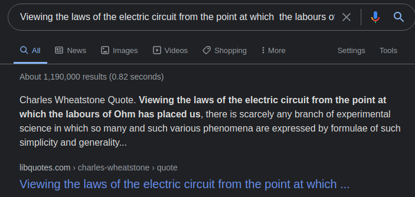
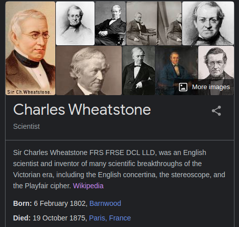
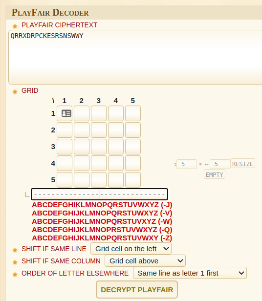
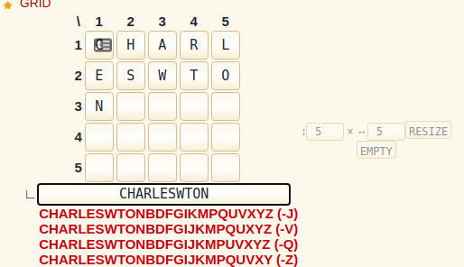
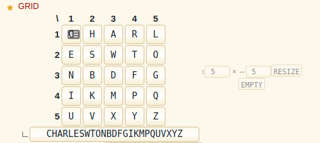
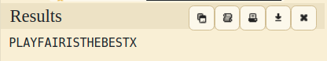

## british scientific

This was the challenge description:

*An old british scientific is trying to help you with this CTF, he only sent you one of his famous quotes. It seems that he has encripted a message, it could be the flag. He always signs with his name and surname...*

We get issued with a message.txt, that provides us with a quote and some code.
```text
Viewing the laws of the electric circuit from the point at which 
the labours of Ohm has placed us, there is scarcely any branch of 
experimental science in which so many and such various phenomena 
are expressed by formulae of such simplicity and generality...

QRRXDRPCKESRSNSWWY
```

I did a quick Google (is our friend) search on the first part of the paragraph and that gave us:



Now we know who said it, I do a similar search:



So we see that he created the Playfair Cipher. Further research takes us to Wikipedia:

https://en.wikipedia.org/wiki/Playfair_cipher

```
The **Playfair cipher** or **Playfair square** or **Wheatstone–Playfair cipher** is a manual [symmetric](https://en.wikipedia.org/wiki/Symmetric_key_algorithm "Symmetric key algorithm") [encryption](https://en.wikipedia.org/wiki/Encryption "Encryption") technique and was the first literal [digram substitution](https://en.wikipedia.org/wiki/Polygraphic_substitution "Polygraphic substitution") cipher. The scheme was invented in 1854 by [Charles Wheatstone](https://en.wikipedia.org/wiki/Charles_Wheatstone "Charles Wheatstone"), but bears the name of [Lord Playfair](https://en.wikipedia.org/wiki/Lord_Playfair "Lord Playfair") for promoting its use.

The technique encrypts pairs of letters (_[bigrams](https://en.wikipedia.org/wiki/Bigram "Bigram")_ or _digrams_), instead of single letters as in the simple [substitution cipher](https://en.wikipedia.org/wiki/Substitution_cipher "Substitution cipher") and rather more complex [Vigenère cipher](https://en.wikipedia.org/wiki/Vigen%C3%A8re_cipher "Vigenère cipher") systems then in use. The Playfair is thus significantly harder to break since the [frequency analysis](https://en.wikipedia.org/wiki/Frequency_analysis "Frequency analysis") used for simple substitution ciphers does not work with it. The frequency analysis of bigrams is possible, but considerably more difficult. With 600[\[1\]](https://en.wikipedia.org/wiki/Playfair_cipher#cite_note-1) possible bigrams rather than the 26 possible monograms (single symbols, usually letters in this context), a considerably larger cipher text is required in order to be useful.
```
As usual a search for online decoder - in this case:
https://www.dcode.fr/playfair-cipher



Having read a little about it, and the hint that he always "He always signs with his name and surname", lets try that.



 As you can see, it removes duplicates. With his name inserted, we can autopopulate the rest with the -J line. Lets try that.



Now when we hit the decrypt button, we get the answer.


 
### flag
NETON{PLAYFAIRISTHEBESTX}
