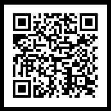
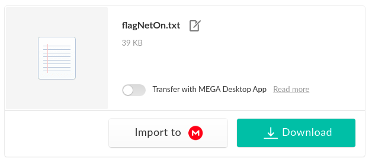
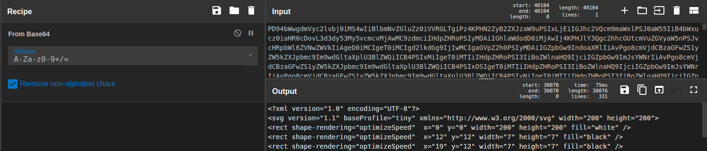
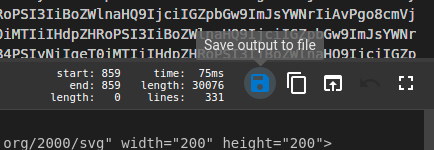
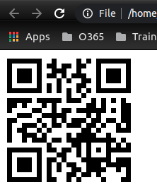

## inception

This was the challenge description:

*Try to get the flag :V*

We are given a .png file that turns out to be a QR code.



Using zbarimg we find it provides a link to mega:
```shell
~/Downloads$ zbarimg qr.png 
QR-Code:https://mega.nz/file/MJYmRLya#vR5UPglFNdgDWNhlhKSPWhXgwCo6zNH_PJHusZwBv9M
scanned 1 barcode symbols from 1 images in 0.01 seconds
```



We download the file, which is a large text file.
```
..............Im9wdGltaXplU3BlZWQiICB4PSI5NiIgeT0iMTgwIiB3aWR0aD0iNyIgaGVpZ2h0PSI3IiBmaWxsPSJibGFjayIgLz4KPHJlY3Qgc2hhcGUtcmVuZGVyaW5nPSJvcHRpbWl6ZVNwZWVkIiAgeD0iMTEwIiB5PSIxODAiIHdpZHRoPSI3IiBoZWlnaHQ9IjciIGZpbGw9ImJsYWNrIiAvPgo8cmVjdCBzaGFwZS1yZW5kZXJpbmc9Im9wdGltaXplU3BlZWQiICB4PSIxNDUiIHk9IjE4MCIgd2lkdGg9IjciIGhlaWdodD0iNyIgZmlsbD0iYmxhY2siIC8+CjxyZWN0IHNoYXBlLXJlbmRlcmluZz0ib3B0aW1pemVTcGVlZCIgIHg9IjE3MyIgeT0iMTgwIiB3aWR0aD0iNyIgaGVpZ2h0PSI3IiBmaWxsPSJibGFjayIgLz4KPHJlY3Qgc2hhcGUtcmVuZGVyaW5nPSJvcHRpbWl6ZVNwZWVkIiAgeD0iMTgwIiB5PSIxODAiIHdpZHRoPSI3IiBoZWlnaHQ9IjciIGZpbGw9ImJsYWNrIiAvPjwvc3ZnPg==
```
If we look at the end of the file the spacers == indicate a Base64 sequence.

Lets tthrow it into GCHQ's CyberChef and bake with From Base64 or indeed click the magic wand:



We see this is now an xml file. 



If we save this and open it in our browser window we see another QR code. 



Same as last time, save this file and run zbarimg, that provides us with the flag.

```shell
~/Downloads$ zbarimg ../Pictures/neton005e.png 
QR-Code:NETON{ThatsRoughBuddy}
scanned 1 barcode symbols from 1 images in 0.01 seconds
```
### flag
NETON{ThatsRoughBuddy}
