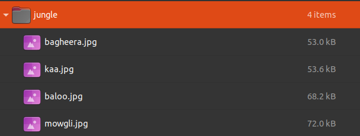

## jungle meeting

This was the challenge description:

*A murder has been committed in the jungle and some friends have gathered to talk about it. Are any of them hiding something from us?*

Provided for us to review are a series of four image files in a jungle.7z compressed file.



If we view all the files, we note that three are visible and one is corrupt. It shows that it is a riff file rather than a jpg. If we simply change the extension we can view the file, which for all four images are characters from the Jungle Book.

I then did a check with a 'grep' command against all the files in the folder and got the answer. My initial run was using the 'strings' command, however reading the actual falg it highlighted metadata.

Using the same 'grep' command but this time checking against 'exiftool,' I also find the flag.

Both are shown below:
```shell
~/Downloads/jungle$ exiftool * | grep -oE NETON{.?*}
NETON{l00k_at_m3tadata}

~/Downloads/jungle$ strings * | grep -oE NETON{.?*}
NETON{l00k_at_m3tadata}
```

If we view the image with 'exiftool' we actually find the flag in the 'city' field.
```shell
======== kaa.jpg
ExifTool Version Number         : 11.88
File Name                       : kaa.jpg
Directory                       : .
File Size                       : 52 kB
File Modification Date/Time     : 2021:02:02 17:13:26+00:00
File Access Date/Time           : 2021:03:05 10:53:48+00:00
File Inode Change Date/Time     : 2021:03:05 10:53:28+00:00
File Permissions                : rw-r--r--
File Type                       : JPEG
File Type Extension             : jpg
MIME Type                       : image/jpeg
JFIF Version                    : 1.01
Resolution Unit                 : None
X Resolution                    : 1
Y Resolution                    : 1
XMP Toolkit                     : Image::ExifTool 12.05
City                            : NETON{l00k_at_m3tadata}
Profile CMM Type                : 
Profile Version                 : 2.0.0
Profile Class                   : Display Device Profile
Color Space Data                : RGB
Profile Connection Space        : XYZ
Profile Date Time               : 2009:03:27 21:36:31
Profile File Signature          : acsp
Primary Platform                : Unknown ()
CMM Flags                       : Not Embedded, Independent
Device Manufacturer             : 
Device Model                    : 
Device Attributes               : Reflective, Glossy, Positive, Color
Rendering Intent                : Perceptual
Connection Space Illuminant     : 0.9642 1 0.82491
Profile Creator                 : 
Profile ID                      : 29f83ddeaff255ae7842fae4ca83390d
Profile Description             : sRGB IEC61966-2-1 black scaled
Blue Matrix Column              : 0.14307 0.06061 0.7141
Blue Tone Reproduction Curve    : (Binary data 2060 bytes, use -b option to extract)
Device Model Desc               : IEC 61966-2-1 Default RGB Colour Space - sRGB
Green Matrix Column             : 0.38515 0.71687 0.09708
Green Tone Reproduction Curve   : (Binary data 2060 bytes, use -b option to extract)
Luminance                       : 0 80 0
Measurement Observer            : CIE 1931
Measurement Backing             : 0 0 0
Measurement Geometry            : Unknown
Measurement Flare               : 0%
Measurement Illuminant          : D65
Media Black Point               : 0.01205 0.0125 0.01031
Red Matrix Column               : 0.43607 0.22249 0.01392
Red Tone Reproduction Curve     : (Binary data 2060 bytes, use -b option to extract)
Technology                      : Cathode Ray Tube Display
Viewing Cond Desc               : Reference Viewing Condition in IEC 61966-2-1
Media White Point               : 0.9642 1 0.82491
Profile Copyright               : Copyright International Color Consortium, 2009
Chromatic Adaptation            : 1.04791 0.02293 -0.0502 0.0296 0.99046 -0.01707 -0.00925 0.01506 0.75179
Image Width                     : 1024
Image Height                    : 587
Encoding Process                : Progressive DCT, Huffman coding
Bits Per Sample                 : 8
Color Components                : 3
Y Cb Cr Sub Sampling            : YCbCr4:2:0 (2 2)
Image Size                      : 1024x587
Megapixels                      : 0.601
```

### flag
NETON{l00k_at_m3tadata}


