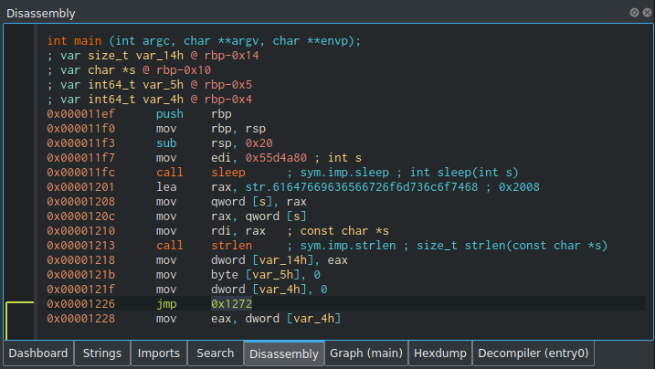

## challenge - sleepy

This was the challenge description:

*Stop sleeping, Get to work! You will have much time to sleep when you get the flag*

*Note: The flag format is Mystiko{FLAG}*

We get a binary called sleepy.out

Firstly I check strings to see if anything pops out
```
:~/Downloads$ strings sleepy.out 
/lib64/ld-linux-x86-64.so.2
putchar
strlen
sleep
__cxa_finalize
__libc_start_main
libc.so.6
GLIBC_2.2.5
_ITM_deregisterTMCloneTable
__gmon_start__
_ITM_registerTMCloneTable
u/UH
[]A\A]A^A_
61647669636566726f6d736c6f7468
;*3$"
GCC: (Debian 10.2.1-6) 10.2.1 20210110
```
 
 One line popped out *61647669636566726f6d736c6f7468* which I checked out with Cyberchef and it turned out to be *advicefromsloth*
 
 I did try this as is and also in the normal flag format, both indicated as incorrect.
 
 After this I ran the file and noticed that it appeared to hang.
 
 As part of my research I used a number of other tools to see what I could get.
 
 - Binary Ninja
 - Cutter
 - IDAfree
 - radare2

As I mentioned the application appeared to hang. Reading down main, we can see it calls sleep.

<br>

<br>

The line in IDA was interesting.
*mov     edi, 55D4A80h   ; seconds*

This in decimal was 90,000,000, so assuming it was milliseconds, was about 25hrs!!

Initially I tried amending this in radare2 to 1000 milliseconds.

For reference my full commands are as follows.

Open file in write mode
```shell
jim@jetj001w:~/Downloads$ radare2 -w sleepy.out 
WARNING: No calling convention defined for this file, analysis may be inaccurate.
```
Analyse the binary 
```shell
[0x00001070]> aaa
[x] Analyze all flags starting with sym. and entry0 (aa)
[x] Analyze function calls (aac)
[x] Analyze len bytes of instructions for references (aar)
[x] Check for objc references
[x] Check for vtables
[x] Type matching analysis for all functions (aaft)
[x] Propagate noreturn information
[x] Use -AA or aaaa to perform additional experimental analysis.
```
List files and sort in order
```
[0x00001070]> afl | sort
0x00001000    3 23           sym._init
0x00001030    1 6            sym.imp.putchar
0x00001040    1 6            sym.imp.strlen
0x00001050    1 6            sym.imp.sleep
0x00001070    1 43           entry0
0x000010a0    4 41   -> 34   sym.deregister_tm_clones
0x000010d0    4 57   -> 51   sym.register_tm_clones
0x00001110    5 57   -> 50   sym.__do_global_dtors_aux
0x00001150    1 5            entry.init0
0x00001155    3 95           sym.hex_to_int
0x000011b4    1 59           sym.hex_to_ascii
0x000011ef    7 146          main
0x00001290    4 93           sym.__libc_csu_init
0x000012f0    1 1            sym.__libc_csu_fini
0x000012f4    1 9            sym._fini
```
Display main
```
[0x00001070]> pdf @main
            ; DATA XREF from entry0 @ 0x108d
┌ 146: main ();
│           ; var signed int64_t var_14h @ rbp-0x14
│           ; var char *var_10h @ rbp-0x10
│           ; var int64_t var_5h @ rbp-0x5
│           ; var int64_t var_4h @ rbp-0x4
│           0x000011ef      55             push rbp
│           0x000011f0      4889e5         mov rbp, rsp
│           0x000011f3      4883ec20       sub rsp, 0x20
│           0x000011f7      bf804a5d05     mov edi, 0x55d4a80
│           0x000011fc      e84ffeffff     call sym.imp.sleep
│           0x00001201      488d05000e00.  lea rax, str.61647669636566726f6d736c6f7468 ; 0x2008 ; "61647669636566726f6d736c6f7468"
│           0x00001208      488945f0       mov qword [var_10h], rax
│           0x0000120c      488b45f0       mov rax, qword [var_10h]
│           0x00001210      4889c7         mov rdi, rax
│           0x00001213      e828feffff     call sym.imp.strlen
│           0x00001218      8945ec         mov dword [var_14h], eax
│           0x0000121b      c645fb00       mov byte [var_5h], 0
│           0x0000121f      c745fc000000.  mov dword [var_4h], 0
│       ┌─< 0x00001226      eb4a           jmp 0x1272
│       │   ; CODE XREF from main @ 0x1278
│      ┌──> 0x00001228      8b45fc         mov eax, dword [var_4h]
│      ╎│   0x0000122b      83e001         and eax, 1
│      ╎│   0x0000122e      85c0           test eax, eax
│     ┌───< 0x00001230      7429           je 0x125b
│     │╎│   0x00001232      8b45fc         mov eax, dword [var_4h]
│     │╎│   0x00001235      4863d0         movsxd rdx, eax
│     │╎│   0x00001238      488b45f0       mov rax, qword [var_10h]
│     │╎│   0x0000123c      4801d0         add rax, rdx
│     │╎│   0x0000123f      0fb600         movzx eax, byte [rax]
│     │╎│   0x00001242      0fbed0         movsx edx, al
│     │╎│   0x00001245      0fbe45fb       movsx eax, byte [var_5h]
│     │╎│   0x00001249      89d6           mov esi, edx
│     │╎│   0x0000124b      89c7           mov edi, eax
│     │╎│   0x0000124d      e862ffffff     call sym.hex_to_ascii
│     │╎│   0x00001252      89c7           mov edi, eax
│     │╎│   0x00001254      e8d7fdffff     call sym.imp.putchar
│    ┌────< 0x00001259      eb13           jmp 0x126e
│    ││╎│   ; CODE XREF from main @ 0x1230
│    │└───> 0x0000125b      8b45fc         mov eax, dword [var_4h]
│    │ ╎│   0x0000125e      4863d0         movsxd rdx, eax
│    │ ╎│   0x00001261      488b45f0       mov rax, qword [var_10h]
│    │ ╎│   0x00001265      4801d0         add rax, rdx
│    │ ╎│   0x00001268      0fb600         movzx eax, byte [rax]
│    │ ╎│   0x0000126b      8845fb         mov byte [var_5h], al
│    │ ╎│   ; CODE XREF from main @ 0x1259
│    └────> 0x0000126e      8345fc01       add dword [var_4h], 1
│      ╎│   ; CODE XREF from main @ 0x1226
│      ╎└─> 0x00001272      8b45fc         mov eax, dword [var_4h]
│      ╎    0x00001275      3b45ec         cmp eax, dword [var_14h]
│      └──< 0x00001278      7cae           jl 0x1228
│           0x0000127a      b800000000     mov eax, 0
│           0x0000127f      c9             leave
└           0x00001280      c3             ret
```
Move to the area I need to amend
```
[0x00001070]> s 0x000011f7

```
Write over the line, with the new 1000 milliseconds
```
[0x000011f7]> wa mov edi, 0x03e8
Written 5 byte(s) (mov edi, 0x03e8) = wx bfe8030000
```
View main again to check changes
```
[0x000011f7]> pdf @main
            ; DATA XREF from entry0 @ 0x108d
┌ 146: main ();
│           ; var signed int64_t var_14h @ rbp-0x14
│           ; var char *var_10h @ rbp-0x10
│           ; var int64_t var_5h @ rbp-0x5
│           ; var int64_t var_4h @ rbp-0x4
│           0x000011ef      55             push rbp
│           0x000011f0      4889e5         mov rbp, rsp
│           0x000011f3      4883ec20       sub rsp, 0x20
│           0x000011f7      bfe8030000     mov edi, 0x3e8
│           0x000011fc      e84ffeffff     call sym.imp.sleep
```
Now quit and try the binary
```shell
0x000011f7]> q
jim@jetj001w:~/Downloads$ ./sleepy.out 
```
Still sleeps so now look to try a jump, which will bypass the sleep call. I did everything again as above.
- Open file in write mode
- Analyse file
- View and sort
- Move to line for amendment

Amend line
```
[0x00001070]> s 0x000011fc
[0x000011fc]> wa jmp 0x00001201
Written 2 byte(s) (jmp 0x00001201) = wx eb03
```
Now confirm line has changed
```
[0x000011fc]> pdf @main
            ; DATA XREF from entry0 @ 0x108d
┌ 146: main ();
│           ; var signed int64_t var_14h @ rbp-0x14
│           ; var char *var_10h @ rbp-0x10
│           ; var int64_t var_5h @ rbp-0x5
│           ; var int64_t var_4h @ rbp-0x4
│           0x000011ef      55             push rbp
│           0x000011f0      4889e5         mov rbp, rsp
│           0x000011f3      4883ec20       sub rsp, 0x20
│           0x000011f7      bfe8030000     mov edi, 0x3e8
│       ┌─< 0x000011fc      eb03           jmp 0x1201
..
│       └─> 0x00001201      488d05000e00.  lea rax, 
```
Now quit and run 
```shell
[0x000011fc]> q
jim@jetj001w:~/Downloads$ ./sleepy.out 
advicefr��s��th
```

Again I tried this as is and also with Mystiko{} to get the flag.

I enjoyed this challenge and it enabled me to have a look at other dis-assemblers and refresh my radare2 knowledge.

Flag
Mystiko{advicefr��s��th}

