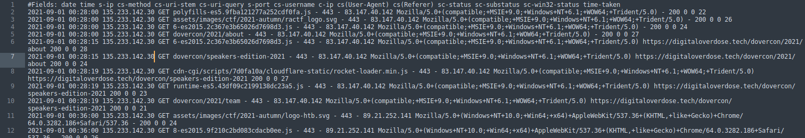

## Part 1 - Ingress

Category: Log Analysis
Points: 100
Description:

>Our website was hacked recently and the attackers completely ransomwared our server! We've recovered it now, but we don't want it to happen again. Here are the logs from before the attack, can you find out what happened?

---
We get to download a file: attack.7z - 55db32

When we extract it we see a log file with a large amount of data:

There are about 38000 lines of data.

In order to sort them more effectively I opened the file in LibreOffice Calc. Looking at the sheets, we can see that one of the fields is `cs-uri-stem`.

I filtered on this and quickly checked through the files, in order to remove any duplicates. When I got to the bottom, there were some strange lines utilising Linux commands from possibly some type of web based attack.

If we remove the bottom command through to cat we actually get what appears to be a base64 text.
`cmd%3Dcat+RE97YmV0dGVyX3JlbW92ZV90aGF0X2JhY2tkb29yfQ==`

Using GCHQ Cyberchef, we get the flag.

FLAG:
DO{better_remove_that_backdoor}

## Part 2 - Investigation

Category: Log Analysis
Points: 150
Description:

>Thanks for finding the RFI vulnerability in our FAQ. We have fixed it now, but we don't understand how the attacker found it so quickly. 
>We suspect it might be an inside job, but maybe they got the source another way. Here are the logs for the month prior to the attack, can you see anything suspicious?
>Please submit the attackers IP as the flag as follow, DO{x.x.x.x}

---
We get to download a file: more.7z - c62a3a

When we extract it we see another similar log file with an even larger amount of data:

This time there are about 191000 lines of data.

Now, I may not have used the correct method for capturing the flag but knowing that the attacker was using a specific text type; in this case base64 for `DO{` I did a search for RE97. This came up with one hit.

Now we have the IP address.

FLAG:
DO{45.85.1.176}

 ## Part 3 - Backup Policy

Category: Log Analysis
Points: 200
Description:

>So it looks like the attacker scanned our site for old backups right? Did he get one?

---
We get to download a file: more.7z - c62a3a (same as before)

Reviewing the file and filtering the `cs-uri-stem`again, this time with the search 'backup.'
We note there are 73 of 191617 records. If we then look in the `time-taken` field we can see that it reports the actual webpage response codes with are either 404 (file not found) or 200 (success status). Checking for successful access we find one.

Using CyberChef again with `RE97czNjcjN0X19fYWdlbnR9` gives us the final flag. 

FLAG:
DO{s3cr3t___agent}
